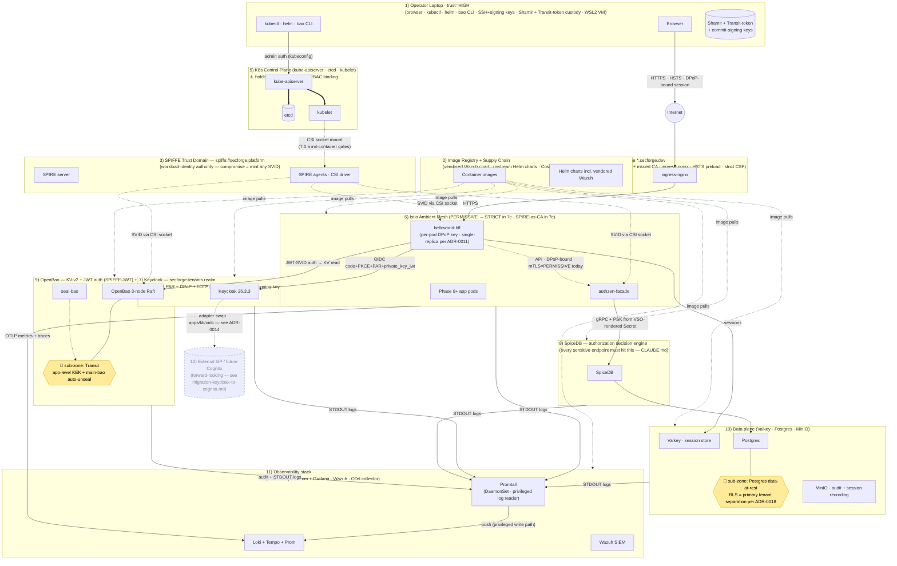

# SecForge Local — Threat Model

**Version:** 0.1 (initial) · **Date:** 2026-05-01 · **Scope:** Local Edition (Docker Desktop K8s)
**Next review:** at Phase 9 (first real apps land), Phase 10 (production-hardening), or any major architecture change. Out of date if the trust-boundary set or the threat-actor set changes without a corresponding revision here.

> **Audience:** every reviewer of a future change to this platform. Before adding a new control, removing one, or accepting a new residual risk, check whether the threat model still describes reality. If it doesn't, update the threat model in the same change.
>
> **What this document is NOT:** a penetration-test plan, a red-team playbook, or a control-by-control compliance crosswalk. Those land at production-hardening time (Phase 10+). See [§6 Compliance-mapping note](#6-compliance-mapping-note-advisory-only) for the family-letter tags this doc provides as a navigability aid.

---

## Scope, threat actors, and out-of-scope assumptions

### Trust zones (12 — see [§1 system diagram](#1-system-diagram-with-trust-boundaries) for the topology)

1. **Operator laptop** — browser, kubectl, helm, bao CLI, SSH + commit-signing keys, Shamir + Transit-token custody, WSL2 VM. Trust = HIGH; a compromise here approaches root for the platform.
2. **Image registry + supply chain** — vendored Wazuh chart, every upstream Helm chart, Cosign keys (currently Audit-mode per [ADR-0004](../02-decisions/0004-kyverno-audit-mode.md)), image pull paths.
3. **SPIFFE trust domain** — `spiffe://secforge.platform`. Workload-identity authority. Compromise = ability to mint any SVID = impersonate any workload. Distinct from the SPIRE component because the trust domain is the abstract authority; SPIRE is one (replaceable) implementation.
4. **Ingress edge** — `*.secforge.dev`, cert-manager + mkcert local CA, ingress-nginx, HSTS preload, CSP nonces, security-header policy. The boundary between "public" and "platform-internal."
5. **K8s control plane** — kube-apiserver, etcd, kubelet. Holds every K8s Secret, every RBAC binding, every CRD. Compromise = total platform compromise. **Distinct from workloads scheduled by it** (the diagram shows this as a separate zone, not as the parent of the per-component zones). Listed explicitly because CLAUDE.md's "no SA cluster-admin" rule does not protect against this zone — it protects flows *through* it.
6. **Istio ambient mesh** — workloads with `istio.io/dataplane-mode=ambient`. Currently `app` namespace only. PeerAuth PERMISSIVE today; tightens to STRICT in [Phase 7c](../99-archive/05-claude-code-prompts/phase-07c-istio-spire-ca-and-strict.md).
7. **Keycloak** — `secforge-tenants` realm. OAuth 2.1 + PAR + DPoP + TOTP (interim per [ADR-0007](../02-decisions/0007-totp-instead-of-passkeys-locally.md)). Realm signing keys with 90-day rotation per [ADR-0006](../02-decisions/0006-keycloak-realm-signing-key-rotation.md).
8. **SpiceDB** — authorization decision engine. Every sensitive endpoint must hit this per CLAUDE.md "Authentication ≠ authorization."
9. **OpenBao** — KV-v2 secrets, JWT auth via SPIFFE-JWT, DB secrets engine, Raft storage. **Sub-zone: Transit** — app-level KEK + main-bao auto-unseal. Treat as a high-value zone within OpenBao but not a top-level boundary.
10. **Data plane** — Valkey (sessions), Postgres, MinIO (audit + session recording). **Sub-zone: Postgres data-at-rest** — RLS = primary tenant separation per [ADR-0018](../02-decisions/0018-multi-tenancy-rls-strategy.md). Sub-zone (not top-level boundary) because RLS is *inside* Postgres; the access path still goes through the Postgres component boundary.
11. **Observability stack** — Loki, Tempo, Prometheus + Grafana, Wazuh, OTel collector. Sees authn + authz outcomes for every request — privacy-relevant + reconnaissance-valuable.
12. **External IdP / future Cognito** — forward-looking, dotted line. Today this is empty (Keycloak is local); migration target documented in [migration-keycloak-to-cognito.md](../99-archive/migration-keycloak-to-cognito.md). Listed so the cloud-edition threat model has an existing slot to populate.

### Threat actors (9)

1. **External unauthenticated attacker** — internet → ingress edge. Goal: any unauthenticated-accessible vulnerability.
2. **Malicious tenant user** — authenticated user trying lateral movement (other tenants' data) or vertical escalation (admin functions).
3. **Compromised app pod** — a Phase 9+ application pod is exploited; attacker uses its SPIFFE-ID for in-cluster lateral movement / data exfil.
4. **Malicious operator with kubectl access** — insider with admin credentials. CLAUDE.md "no SA cluster-admin" mitigates the worst service-account flavor of this; human admins still exist.
5. **Compromised supply chain** — malicious image, dependency, or vendored chart enters via the build / image-pull path.
6. **Malicious browser extension on operator's laptop** — extensions can read session cookies, intercept DPoP signatures, exfiltrate OIDC tokens. Distinct from "operator with kubectl" — it doesn't need elevated privileges, just runs in the operator's regular browser session.
7. **Compromised BFF code** — distinct from "compromised app pod" because the BFF holds session cookies, the per-pod DPoP private key (per [ADR-0011](../02-decisions/0011-bff-single-replica-local.md)), and audience-bound access tokens for every downstream API. Compromise = total auth compromise. **Stolen DPoP private key** is a sub-scenario here (same blast radius, same mitigations).
8. **Compromised observability stack** — Loki/Tempo/Wazuh see all authn + authz outcomes for every user. Compromise = privacy issue + audit-trail integrity issue + reconnaissance value (attacker can see which exploits worked before the operator does).
9. **Lost or stolen operator device** — distinct from "malicious operator." Different motive (none — opportunistic), different mitigations (full-disk encryption, SSH-key passphrase, off-device Shamir custody). Adjacent to but separate from insider.

### Out of scope (cloud-edition inversion checklist)

> **⚠️ Cloud-edition reviewer:** every one of these out-of-scope items **inverts to in-scope** when this threat model is rewritten for the cloud edition. Treat this list as your starting checklist. If you don't address each item explicitly in the cloud-edition rewrite, you've left a gap.

- **Multi-operator threat model.** Single-developer assumption today. Cloud edition: operator vs. team-member vs. SRE-on-call vs. compliance-auditor vs. break-glass.
- **Docker Desktop / WSL2 host compromise.** Trusted today. Cloud edition: K8s nodes are EC2/EKS instances; node-level compromise becomes in-scope.
- **HSM-less software keys.** All cryptographic material is software-backed today. Cloud edition: KMS / HSM decision becomes load-bearing.
- **mkcert local CA trust.** Trusted today (operator installed it themselves). Cloud edition: Let's Encrypt / private CA / cert-pinning becomes a real concern.
- **Local DNS via `/etc/hosts`.** No DNS-hijack scenario locally. Cloud edition: Route 53 / DNSSEC / DNS rebinding all in-scope.
- **Physical access to a running, unlocked laptop.** Out-of-scope per standard threat-model assumption. Cloud edition: bastion hosts, console access via cloud provider, physical-data-center risks.
- **Local network attacker.** Implicitly out-of-scope today; cluster bound to localhost. Cloud edition: VPC peering, transit gateways, public-subnet exposure all in-scope.
- **Quantum attack on ed25519 / RSA.** Out of scope at any horizon this document covers. Re-evaluate if PQ migration becomes load-bearing pre-deployment.

---

## 1. System diagram with trust boundaries



### Diagram legend

| Convention | Meaning |
|---|---|
| Solid arrow `─▶` | Currently-enforced edge with the labeled control |
| **Dashed arrow `┄▶`** | **Currently-PERMISSIVE mesh edge — NOT enforced as mTLS today.** Tightens to STRICT in [Phase 7c](../99-archive/05-claude-code-prompts/phase-07c-istio-spire-ca-and-strict.md) per [`docs/03-runbooks/istio-peer-auth-tighten.md`](../03-runbooks/istio-peer-auth-tighten.md). When 7c lands, swap dashed → solid in the same edit that flips PeerAuth. |
| Diamond + yellow fill `🔐` | Sub-zone (high-value zone within a parent component) — Transit inside OpenBao, RLS inside Postgres |
| Dotted-outline future node `┈┈┈┈┈` | Forward-looking; not deployed today |
| Z5 vs Z6/Z7/.../Z11 | **Z5 (control plane) is the substrate** — kube-apiserver / etcd / kubelet — and is **distinct from the workloads scheduled by it (Z6–Z11)**. Compromising Z5 compromises everything else; compromising Z6–Z11 does not, by itself, compromise Z5. |

**ASCII fallback** (for renderers without mermaid):

```
[Internet]
    │
    ▼  HTTPS · HSTS · DPoP-bound
┌───────────────────────────────────────────────────────────────────────────┐
│ Z4) Ingress edge *.secforge.dev · cert-manager + mkcert · ingress-nginx │
└─────────────────────────────────┬─────────────────────────────────────────┘
                                  │
                                  ▼
                    ┌────────────────────────┐
                    │ Z6) Istio ambient mesh │
                    │  helloworld-bff (DPoP) │──OIDC──▶ Z7) Keycloak
                    │  authzen-facade        │──gRPC──▶ Z8) SpiceDB ──▶ Z10) Postgres (RLS sub-zone)
                    │  Phase 9+ apps         │──JWT───▶ Z9) OpenBao  (Transit sub-zone)
                    └────────────────────────┘──sess──▶ Z10) Valkey
                                                       Z10) MinIO
                                  ▲
                                  │ SVID issuance
                    Z3) SPIFFE trust domain (spiffe://secforge.platform)

[Operator laptop Z1] ─kubectl─▶ Z5) K8s control plane (apiserver+etcd+kubelet)
                                       └──stores every Secret + RBAC binding
[Z2 Image registry/supply chain] ─image pulls─▶ every workload
[Z11 Observability] ─scrapes/logs/traces─▶ every component

[Z12 External IdP / future Cognito] ⊶ adapter swap (apps/lib/oidc) — forward-looking
```

**Key boundary rules:**

- Every cross-zone edge must list a control. Edges with no listed control are gaps; surface them in this section's review-history.
- Sub-zones (Transit, Postgres-RLS) are inside their parent zone for ingress purposes but require an additional access decision once the parent boundary is crossed (defense-in-depth). E.g., reaching Postgres at all is the first gate; reading another tenant's row through it is the RLS gate.
- The **mesh boundary (Z6)** is currently weaker than the diagram suggests because PeerAuth is PERMISSIVE. STRICT cutover is [Phase 7c](../99-archive/05-claude-code-prompts/phase-07c-istio-spire-ca-and-strict.md); residual risks include what STRICT closes.

---

## 2. Data flows across boundaries

Each flow lists the boundaries crossed (in order), the controls at each crossing, and the "what could go wrong if a boundary fails" surface that §3 STRIDE rows pick up. Flows are described in their **current state** (not aspirational); changes coming in Phase 7c (STRICT mesh) and Phase 7d (rotation/housekeeping) are flagged inline.

### 2.1 — Login flow (browser → Keycloak via BFF)

```
[Z1 Browser] ──HTTPS──▶ [Z4 Ingress] ──▶ [Z6 BFF] ──PAR──▶ [Z7 Keycloak]
                                                 ◀──code───
                          [Z6 BFF] ──code+PKCE+private_key_jwt──▶ [Z7 Keycloak]
                                                                  ◀── ID/access/refresh + DPoP cnf.jkt ──
                          [Z6 BFF] ──opaque session id──▶ [Z10 Valkey]
                          [Z6 BFF] ──Set-Cookie: HttpOnly+Secure+SameSite=Lax──▶ [Z1 Browser]
```

| # | Boundary crossed | Control | Failure mode this introduces |
|---|---|---|---|
| 1 | Z1 → Z4 | TLS 1.3 (mkcert local CA) + HSTS preload + DPoP-bound session header | If Z4 is bypassed (e.g. direct port-forward to BFF), `X-Forwarded-*` headers are absent → BFF fails-closed per [dpop-htu-canonicalization.md § BFF inbound](../06-reference/dpop-htu-canonicalization.md). |
| 2 | Z4 → Z6 (BFF) | ingress-nginx TLS termination → re-TLS to BFF; CSP nonce + HSTS injected on response | Stripped headers / spoofed `X-Forwarded-Host` would silently break DPoP `htu` agreement — fail-closed at BFF inbound. |
| 3 | Z6 (BFF) → Z7 (Keycloak) | OAuth 2.1 + PAR + private_key_jwt client auth (per-pod RSA-2048; 90-day rotation in Phase 7d); PKCE | Keycloak compromise (Z7) leaks ID/access/refresh tokens. Per-client signing key limits blast radius. |
| 4 | Z7 → Z6 (BFF) | DPoP-bound access token (`cnf.jkt` matches BFF's per-pod public key) | DPoP key compromise = total session compromise (per-pod, single-replica per [ADR-0011](../02-decisions/0011-bff-single-replica-local.md)). |
| 5 | Z6 (BFF) → Z10 (Valkey) | Opaque session id (random); JWT itself stays in Valkey, NOT in cookie | Valkey compromise = session-token theft. Today: same-cluster trust; cloud edition: Transit-encrypted at rest. |
| 6 | Z6 → Z1 (Browser) | HttpOnly + Secure + SameSite=Lax + Path=/ ; idle 30m / hard-cap 8h per [ADR-0017](../02-decisions/0017-session-expiry-semantics.md) | Cookie theft via XSS mitigated by HttpOnly + strict CSP nonces; **CLAUDE.md forbids localStorage for tokens** (this is the bright-line rule). |

### 2.2 — API call flow (browser → backend via BFF + AuthZEN)

```
[Z1 Browser] ──HTTPS + cookie + DPoP proof──▶ [Z4 Ingress] ──▶ [Z6 BFF]
   [Z6 BFF] validates DPoP (htu/htm/iat/jti per dpop-htu-canonicalization.md)
   [Z6 BFF] ──HTTP + JWT (audience-bound) + DPoP-bound (per ADR-0014)──▶ [Z6 backend (Phase 9+)]
   [Z6 backend] ──gRPC + PSK──▶ [Z6 AuthZEN-facade] ──gRPC + PSK──▶ [Z8 SpiceDB] ──SQL──▶ [Z10 Postgres]
                                                                                              + RLS sub-zone:
                                                                                              SET LOCAL app.tenant_id
```

| # | Boundary crossed | Control | Failure mode |
|---|---|---|---|
| 1 | Z1 → Z6 (via Z4) | Cookie + DPoP (proof of possession) | DPoP replay-cache (60s + skew) per ADR-0014 step 15; replay outside window rejected. |
| 2 | Z6 (BFF) → Z6 (backend) | JWT audience-bound (per [ADR-0014](../02-decisions/0014-api-auth-library-design.md)) + DPoP-bound (BFF re-mints proof; htu = backend URL) | Audience-at-login limits a stolen access token to its declared audience set. Cross-API misuse rejected at backend `ValidateInbound`. |
| 3 | Z6 → Z8 (SpiceDB) | gRPC + PSK from VSO-rendered Secret per [ADR-0015](../02-decisions/0015-secret-distribution-pattern.md); **NOT mesh-protected today** (spicedb ns is not in mesh) | PSK leak = AuthZ bypass on the SpiceDB side. NetworkPolicy is the L4 boundary. |
| 4 | Z8 → Z10 (Postgres + RLS sub-zone) | TLS to Postgres + Row-Level Security with `SET LOCAL app.tenant_id = $tenant` per [ADR-0018](../02-decisions/0018-multi-tenancy-rls-strategy.md); `FORCE ROW LEVEL SECURITY` required | Static `datastore_uri` workaround risks desync after CNPG password rotation (tracked Phase 7d). |

### 2.3 — Secret-bootstrap flow (workload → OpenBao)

```
[Z6 BFF or app] ──SPIFFE-CSI mount──▶ [Z3 SPIRE agent socket]
                                       └──▶ JWT-SVID with audience=openbao
[Z6 BFF] ──auth/jwt/login──▶ [Z9 OpenBao]
                              └──client_token──▶
[Z6 BFF] ──KV-v2 read at secret/data/keycloak/clients/<id>──▶ [Z9 OpenBao]
                                                              └──private_pem──▶ [Z6 BFF in-memory only]
```

| # | Boundary crossed | Control | Failure mode |
|---|---|---|---|
| 1 | Z6 → Z3 (SPIFFE socket) | Kubelet mounts the SPIFFE-CSI volume; **`wait-for-spiffe-csi` init container** blocks main start until socket exists (Phase 7.0.a fix for cold-boot race — F-CLU-1) | Compromised kubelet could redirect the socket → impersonate workloads. Mitigation: kubelet runs in Z5 (control-plane); compromise of Z5 is a separate, explicit threat. |
| 2 | Z6 → Z9 (OpenBao JWT auth) | JWT-SVID validated against SPIRE OIDC discovery provider; bound_claims match SPIFFE-ID prefix | Leaked JWT-SVID is short-lived (5min TTL); Phase 7d may extend per cold-pause TTL strategy. |
| 3 | Z9 → Z6 (KV read) | Per-role policy (read-only on `secret/data/keycloak/clients/<id>`) | Token compromise = read-only access to the bound paths only; no Transit access without separate role. |
| 4 | Z6 in-memory | Secret kept in process memory; never logged, never disk-cached. **Hardened-mode redaction** lands in Phase 6b-2. | Compromised BFF code (actor A7) reads in-memory secrets — biggest BFF residual risk. |

### 2.4 — Audit-log flow (every component → Loki/Tempo/Wazuh)

```
[Any zone] ──STDOUT structured JSON──▶ [Z11 Promtail (DaemonSet, hostPath /var/log/pods)]
                                       └──push──▶ [Z11 Loki]
[Z6 BFF + Z6 AuthZEN] ──OTLP/gRPC traces+metrics──▶ [Z11 OTel collector] ──▶ [Z11 Tempo + Prom]
[Z9 OpenBao audit] ──future: syslog (Phase 7d)──▶ [Z11 Wazuh manager:1514]
[Z7 Keycloak events] ──future: spi-events-listener-syslog (Phase 7d)──▶ [Z11 Wazuh manager:1514]
```

| # | Boundary crossed | Control | Failure mode |
|---|---|---|---|
| 1 | Workload → Promtail | Promtail reads via hostPath `/var/log/pods/`; no in-cluster auth between workload and Promtail (logs are file-system writes the workload doesn't see) | Compromised Promtail = visibility into every workload's logs (privileged read path). Actor A8 covers this. |
| 2 | Promtail → Loki | NetworkPolicy restricts to observability ns; basic-auth not enforced today (cloud edition gap) | Compromised Promtail can write arbitrary log entries (audit-trail tampering). Cloud edition: Loki must require auth. |
| 3 | BFF/AuthZEN → OTel | OTLP/gRPC over `http://otel-collector...:4317`; in-cluster, NetworkPolicy-gated | OTLP bears trace IDs but never tokens or secrets — by-construction (BFF wraps handlers with `otelhttp` after the auth-strip). |
| 4 | OpenBao/Keycloak → Wazuh | NetworkPolicy `allow-syslog-to-wazuh-manager` already allows; sender-side wiring is Phase 7d | Until Phase 7d, OpenBao audit + Keycloak events are NOT in Wazuh — covered as Phase 7d follow-up. |

---

## 3. STRIDE per component

Component coverage (13 total): BFF (this row, format-setter) · AuthZEN-facade · Keycloak · SpiceDB · OpenBao (incl. Transit sub-zone) · SPIRE · Valkey · Postgres (incl. RLS sub-zone) · MinIO · Istio mesh · Ingress · Observability stack · Future Phase 9+ apps.

### 3.0 — Severity matrix (used by every row below)

Severity is a single letter (`L` / `M` / `H`) computed from a 5×5 risk matrix. Every threat row gives only the reduced letter; consult this table to back out the `Impact × Likelihood` reasoning.

**Impact** (consequence if the threat materializes):

| Level | Meaning |
|---|---|
| **Insignificant** | Cosmetic / no real loss (e.g. a log line is duplicated). |
| **Minor** | Recoverable without user-visible disruption (e.g. a transient 5xx that retries clear). |
| **Significant** | User-visible disruption or single-user data exposure with audit-trail evidence. |
| **Major** | Cross-user data exposure, full single-user session compromise, or audit-trail integrity loss. |
| **Severe** | Platform-wide compromise, cross-tenant data leak, or cryptographic-root compromise (Transit, SPIFFE trust domain, realm signing key). |

**Likelihood** (probability the threat actually materializes against today's actor set):

| Level | Meaning |
|---|---|
| **Rare** | Requires improbable combination of failures or has no realistic path with current actors. |
| **Unlikely** | Single point of failure that is well-mitigated; demands attacker capability beyond default actors. |
| **Moderate** | Plausible against a determined default actor (A1–A9) over a multi-month horizon. |
| **Likely** | Expected to occur within a normal operational period for at least one of the actors. |
| **Almost Certain** | Will happen as part of normal operation if not actively prevented. |

**Reduction (5×5 → L/M/H):**

|  | Rare | Unlikely | Moderate | Likely | Almost Certain |
|---|---|---|---|---|---|
| **Severe** | M | H | H | H | H |
| **Major** | L | M | M | H | H |
| **Significant** | L | L | M | M | H |
| **Minor** | L | L | L | M | M |
| **Insignificant** | L | L | L | L | L |

> **⚠️ Cloud-edition re-rate required.** Every threat in this section will re-rate when the cloud-edition threat model is written, because the actor set inverts: multi-operator (A4 grows to A4a/A4b/A4c), WAN attackers (A1 likelihood jumps from "Unlikely" to "Almost Certain"), real DNS attack surface (was out-of-scope), and HSM-vs-software-key decisions all shift Impact and Likelihood independently. Treat the local-edition ratings as today's snapshot, not the platform's permanent risk posture.

### 3.0a — Mitigation citation rule

**Mitigation (existing)** cites a specific ADR, runbook, NetworkPolicy, AuthorizationPolicy, code path, or CLAUDE.md rule. "We're careful" / "we use TLS" / "we follow best practices" are NOT mitigations — name the cert source, the trust anchor, the validation step, the policy file. If the mitigation cites a phase that hasn't run yet, tag it (e.g. "Phase 7c lands STRICT mTLS" or "Phase 6b-2 lands Hardened-mode redaction"); those are forward-looking mitigations, useful for tracking but not yet in effect.

### 3.0b — Residual-risk escalation rule

**Residual risk** is what remains AFTER the listed mitigation. Three categories:

- **Tracked-but-not-accepted** — known fix path scheduled. Tagged inline (e.g. "Pre-7c:") so the reader can grep for what each scheduled phase closes.
- **Accepted residual** — known issue, no scheduled fix, operator has explicitly signed off. Rolls into [§5](#5-accepted-residual-risks-require-operator-sign-off).
- **Rated `H` residual** — defaults to **accepted residual** (operator signs off in §5). May be downgraded to "tracked" only with an explicit phase + ADR scheduling the fix.

### 3.1 — BFF (`helloworld-bff` — format-setting row)

The BFF holds the most attack surface in the platform: every browser request lands here, it terminates the user session, it mints DPoP proofs against backends, and it bootstraps its own credentials from OpenBao at startup. STRIDE for the BFF exercises every primitive (DPoP, OIDC, SPIFFE, mesh, Valkey, audit). Future BFF instances (`pf-bff`, `pt-bff`, `pm-bff`) inherit this row; per-app deltas land at Phase 10.

> **(R1) Repudiation is hoisted out of this row.** "No tamper-evident log chain" applies to every component, not just BFF, so it lives in [§4 Cross-cutting threats](#4-cross-cutting-threats) as a single row that all component STRIDE rows reference. R1 is also promoted to [§5 Accepted residual risks](#5-accepted-residual-risks-require-operator-sign-off) since cloud-edition is the fix path and cloud-edition isn't scheduled.

| Threat | Severity | Mitigation (existing) | Residual risk |
|--------|----------|----------------------|---------------|
| **(S1) Spoof a user → BFF** by stealing an access/refresh token and replaying it | M (Major × Moderate) | DPoP-bound tokens (`cnf.jkt` per [RFC 9449](https://datatracker.ietf.org/doc/html/rfc9449)); per-pod DPoP key per [ADR-0011](../02-decisions/0011-bff-single-replica-local.md); short-lived access tokens per [ADR-0016](../02-decisions/0016-token-and-credential-lifetimes.md); HttpOnly+Secure+SameSite=Lax cookie | Replay outside DPoP `iat`-skew window only succeeds if the attacker holds the DPoP private key — covered separately as I3 (Stolen DPoP private key = total session compromise; actor A7 sub-scenario). |
| **(S2) Spoof a backend → BFF** (return-trip; backend impersonator) | M (Major × Unlikely) | Mesh PeerAuth currently **PERMISSIVE** (will be STRICT post-7c); SPIRE-issued SVIDs for backend identity post-7c | **Pre-7c:** the BFF can reach any in-cluster pod that responds on the route's port — no mTLS enforcement. This is the primary motivator for Phase 7c. Until 7c lands, NetworkPolicy is the only L4 boundary. **Tracked-but-not-accepted** (Phase 7c is the scheduled fix). |
| **(T1) Tamper with session cookie** (forge or modify cookie value) | L (Major × Rare) | Cookie carries an opaque session ID only — actual JWT lives in Valkey; HttpOnly + Secure + SameSite=Lax + Path=/ ; idle 30m / hard-cap 8h per [ADR-0017](../02-decisions/0017-session-expiry-semantics.md) | Forging requires guessing a valid Valkey session ID (effectively zero given random 256-bit IDs). Failure mode is silent re-login on Valkey purge — a UX residual, not a security one. |
| **(T2) Tamper with DPoP proof** (replace `htu`, `htm`, `iat`, or `jti`) | L (Major × Rare) | DPoP signature covers protected header + payload; BFF inbound canonicalizes per [`dpop-htu-canonicalization.md`](../06-reference/dpop-htu-canonicalization.md) and **fails closed if `X-Forwarded-*` headers are absent**; replay-cache 60s + skew per [ADR-0014](../02-decisions/0014-api-auth-library-design.md) step 15 | Path-normalization mismatch between proxy and BFF could silently mismatch. Canonicalization rule deliberately does NOT normalize paths (any mismatch is a real bug, not silently hidden). |
| **(T3) Tamper with response body in flight** | L (Significant × Unlikely) | TLS via ingress (Z4) + future mesh mTLS (Z6 post-7c); same-trust-domain SVIDs issued by SPIRE (Z3) | **Pre-7c:** mesh mTLS not enforced. NetworkPolicy + the response body's structured shape (BFF doesn't trust client-provided IDs) limit the practical attack. **Tracked-but-not-accepted** (Phase 7c). |
| **(I1) Tokens leak via logs** | L (Significant × Unlikely) | Hardened-mode redaction lands in [Phase 6b-2 / ADR-0013](../02-decisions/0013-no-env-secrets.md); BFF's structured logger never logs token values; OTel handler-wrapping happens AFTER auth-strip | Pre-6b-2, the redaction-aware logger is not yet in `apps/lib/`. The BFF today is well-behaved by review, not by guardrail. **Tracked-but-not-accepted** (Phase 6b-2 is the fix). |
| **(I2) Tokens leak via XSS** | L (Major × Rare) | Strict CSP with nonces (per [04-bff-pattern.md § CSP nonce](../01-architecture/04-bff-pattern.md#csp-nonce-derivation)); HttpOnly cookies; **CLAUDE.md "no localStorage for tokens" bright-line rule**; HSTS preload | XSS in the BFF's served HTML is the only practical vector; CSP nonces require a stored-XSS bypass that doesn't hit the nonce. Real but rare for a BFF with no user-controlled HTML. |
| **(I3) DPoP private key leak (in-pod)** | H (Severe × Unlikely) | Per-pod key + single-replica per [ADR-0011](../02-decisions/0011-bff-single-replica-local.md); key generated at startup, never written to disk, never logged; no admin-API exposure of the key | Compromised BFF code (actor A7) reads the in-pod key from process memory → mints arbitrary DPoP proofs → impersonates the BFF for the lifetime of the access-token cache. Cloud-edition mitigation: per-session keys persisted in Valkey with Transit-encrypted-at-rest (Phase 6 follow-up #3). **Accepted residual** — see [§5](#5-accepted-residual-risks-require-operator-sign-off). |
| **(I4) Side-channel via observability** (compromised obs stack reads BFF logs) | M (Major × Unlikely) | Promtail → Loki write path runs in observability ns with NetworkPolicy gating; observability ns is NOT in mesh (no AuthN of log writers today) | Actor A8 (compromised observability stack) sees authn outcomes for every user → reconnaissance value. Cloud-edition mitigation: encrypt log payloads + require auth on Loki writes. **Accepted residual** — see §5. |
| **(D1) Session-creation flood** | L (Minor × Moderate) | ingress-nginx default rate-limit per source IP; Valkey TTL evicts dead sessions; BFF doesn't allocate per-anonymous-request resources | Local edition has only the operator's laptop as a source IP; cloud-edition will need finer rate-limiting + Keycloak's brute-force detection enabled. |
| **(D2) DPoP-validation cost amplification** | L (Insignificant × Rare) | Replay-cache lookup is O(1) Valkey GET; rejected proofs short-circuit before any expensive op | Practically unexploitable at local-edition scale. |
| **(D3) Cold-boot Transit token expiry → BFF startup blocked** | M (Significant × Likely) | Workaround documented in [`openbao-seal-unseal.md § Main openbao stuck sealed=true`](../03-runbooks/openbao-seal-unseal.md); permanent fix in Phase 7d (TTL strategy review per [ADR-0009](../02-decisions/0009-openbao-seal-strategy.md)) | Hits real operational availability for part-time clusters. Already a known operational reality, not an exploit. **Tracked-but-not-accepted** (Phase 7d). |
| **(E1) User → admin elevation via stolen admin session** | M (Major × Unlikely) | AuthZ check at every sensitive endpoint per CLAUDE.md "Authentication ≠ authorization"; admin operations route through SpiceDB tuples, NOT session-claim flags | Mitigation depends on SpiceDB schema correctness for the admin object. Phase 9 will be the first place this is exercised end-to-end. |
| **(E2) Compromised BFF pod (actor A7) → all sessions** | H (Severe × Unlikely) | Per-pod DPoP key (limits time-window to access-token TTL); short-lived access tokens; Cosign image signing at supply-chain phase (currently Audit-mode per [ADR-0004](../02-decisions/0004-kyverno-audit-mode.md) — F-ADR-12 flag); Kyverno PSS-restricted; SPIFFE-ID is per-workload (`app/helloworld-bff`) | Image signing in **Audit-mode** today means a malicious image with a missing signature is logged but not blocked. F-ADR-12 schedules the flip-to-Enforce. **Accepted residual** — see §5. |
| **(E3) Compromised app pod (actor A3) → BFF SPIFFE-ID escalation** | M (Major × Unlikely) | SPIFFE-ID is per-workload (no shared identity); ambient mesh AuthorizationPolicy in `app` ns will deny non-`bff` callers post-7c; NetworkPolicy is the L4 boundary today | **Pre-7c:** an `app`-ns pod with the right port can reach the BFF's internal endpoints. NetworkPolicy reduces but doesn't eliminate. **Tracked-but-not-accepted** (Phase 7c). |

**BFF row notes for the format-setter pattern (carried into other components in pass 3):**

- Every threat row names a **specific control** (ADR / runbook / code path / CLAUDE.md rule).
- **Severity** comes from the [§3.0 5×5 matrix](#30--severity-matrix-used-by-every-row-below); each cell shows both the reduced letter and the matrix-cell reasoning (e.g. "M (Major × Moderate)").
- **Residual risks rated H** default to [§5 Accepted residual risks](#5-accepted-residual-risks-require-operator-sign-off) for operator sign-off. BFF row produces two H-rated (I3 DPoP key leak, E2 compromised pod), plus I4 (M-rated but content-promoted because cloud-edition is the fix path).
- **Pre-Phase-7c gaps** tagged inline with "Pre-7c:" — see [§3.14](#314--threats-phase-7c-closes-cross-component-checklist) for the full list.
- **R1 hoisted** to [§4 Cross-cutting](#4-cross-cutting-threats) (the no-tamper-evident-log-chain issue applies platform-wide, not just to BFF). BFF still emits structured per-request logs once Phase 9 lands (Phase 7.9 verify-e2e identified the gap).

### 3.14 — Threats Phase 7c closes (cross-component checklist)

Phase 7c (SPIRE-as-CA + PeerAuthentication STRICT) closes a specific set of "Pre-7c:" tagged residuals across multiple components. When 7c runs, the operator verifies each row was actually closed and re-rates accordingly.

| Threat row | Component | Why 7c closes it |
|---|---|---|
| **S2** Spoof a backend → BFF | BFF (§3.1) | STRICT mTLS rejects callers without a valid SPIRE-issued SVID; a backend impostor without `spiffe://secforge.platform/ns/.../sa/...` cannot complete the handshake |
| **T3** Tamper response body in flight | BFF (§3.1) | STRICT mTLS protects in-mesh response bodies between SVID-bearing peers |
| **E3** Compromised app pod → BFF SPIFFE-ID escalation | BFF (§3.1) | Per-namespace AuthorizationPolicy in `app` ns + STRICT denies non-BFF callers; NetworkPolicy moves from sole defense to L4 belt-and-suspenders |
| **S1** Spoof BFF caller → AuthZEN | AuthZEN-facade (§3.2) | STRICT mTLS + per-namespace AuthorizationPolicy restricts to BFF SPIFFE-ID specifically; PSK becomes belt-and-suspenders |
| **S2** Spoof AuthZEN → SpiceDB | AuthZEN-facade (§3.2) | Same: STRICT + AuthorizationPolicy in `spicedb` ns |
| **T1** Tamper request body in flight | AuthZEN-facade (§3.2) | STRICT mTLS protects in-mesh body |
| **S1** Spoof tuple writer | SpiceDB (§3.4) | STRICT mTLS + AuthorizationPolicy denies non-AuthZEN callers |
| **T1** Tamper tuples in flight | SpiceDB (§3.4) | STRICT mTLS protects in-mesh body |
| **S1** Spoof workload identity | Istio mesh (§3.10) | The whole point of Phase 7c — STRICT enforces SVID-based mTLS |
| **T1** Tamper traffic in flight | Istio mesh (§3.10) | Same |

> **Cross-link from PLAN.md Phase 7c:** the [Phase 7c quick-ref row](../../PLAN.md#phase-7c--istio-spire-as-ca-cutover--peerauthentication-strict-1-2-days) and the [phase prompt](../99-archive/05-claude-code-prompts/phase-07c-istio-spire-ca-and-strict.md) reference this section. When 7c executes against [`docs/03-runbooks/istio-peer-auth-tighten.md`](../03-runbooks/istio-peer-auth-tighten.md), tick each row off here and bump §7 review history.

---

### 3.2 — AuthZEN-facade

The AuthZEN-facade is a stateless gRPC/HTTP shim that translates AuthZEN HTTP API into SpiceDB CheckPermission gRPC. It holds a PSK to talk to SpiceDB. No browser-facing surface; in-mesh; called by BFF.

| Threat | Severity | Mitigation (existing) | Residual risk |
|---|---|---|---|
| **(S1) Spoof BFF caller → AuthZEN** | M (Major × Unlikely) | gRPC + PSK from VSO-rendered Secret per [ADR-0015](../02-decisions/0015-secret-distribution-pattern.md); NetworkPolicy gates `app/helloworld-bff` only | **Pre-7c:** any pod with the PSK + network access can pose as BFF. PSK leak = AuthZ bypass. **Tracked-but-not-accepted** (Phase 7c). |
| **(S2) Spoof AuthZEN → SpiceDB** | M (Major × Unlikely) | Same PSK; NetworkPolicy in `spicedb` ns | **Pre-7c.** Same path as S1. **Tracked-but-not-accepted** (Phase 7c). |
| **(T1) Tamper request body in flight** | L (Significant × Rare) | TLS via mesh (PERMISSIVE today); request body small + structured | **Pre-7c.** **Tracked-but-not-accepted** (Phase 7c). |
| **(I1) Authz request leakage via logs** | L (Minor × Rare) | AuthZEN-facade does NOT log subject/resource by default; only decision outcome | Logger-level changes need review (Phase 6b-2 Hardened-mode). |
| **(D1) Authz-request flood** | L (Minor × Moderate) | SpiceDB cache hit reduces cost; NetworkPolicy gates inbound | A compromised BFF can flood (actor A7 sub-effect). |
| **(E1) Decision tampering → privilege escalation** (compromised AuthZEN returns `permitted=true`) | M (Severe × Unlikely) | AuthZEN-facade is a thin shim — always asks SpiceDB live; no decision caching that could go stale; image signing in Audit-mode per ADR-0004 | **Tracked under X-R2** (supply-chain / image signing flip-to-Enforce). |

### 3.3 — Keycloak

OIDC identity provider (`secforge-tenants` realm + `master` realm). Holds the realm signing keys. Largest external-attack surface after the ingress.

| Threat | Severity | Mitigation (existing) | Residual risk |
|---|---|---|---|
| **(S1) Spoof IdP via phishing fake login page** | L (Severe × Rare) | HSTS preload + browser cert-pinning (mkcert OS-level CA trust); operator's browser tab indicates valid cert | Local edition: phishing requires gaining `auth.secforge.dev` DNS resolution (laptop-local). Cloud-edition: jumps in likelihood. |
| **(S2) Spoof user via stolen TOTP** | M (Major × Moderate) | TOTP per [ADR-0007](../02-decisions/0007-totp-instead-of-passkeys-locally.md) (interim); brute-force-detection enabled in Keycloak; recovery codes in Shamir custody | **TOTP is interim.** Passkeys/FIDO2 land at production-hardening per ADR-0007. **Tracked-but-not-accepted** (production hardening). |
| **(S3) Spoof admin via stolen master-realm credential** | M (Major × Unlikely) | Admin console on separate hostname per CLAUDE.md; admin auth requires TOTP; master-realm separated from tenant realm | Operator's TOTP device = single point of failure; recovery codes Shamir-distributed mitigate device loss. |
| **(T1) Tamper realm configuration** | M (Major × Unlikely) | All kcadm changes via committed Path-A scripts at `infrastructure/keycloak/clients/`; Keycloak admin-event log captures changes | **See X-R1** (no tamper-evident log chain). |
| **(T2) Tamper realm signing key** | H (Severe × Rare) | Realm signing keys 90-day rotation per [ADR-0006](../02-decisions/0006-keycloak-realm-signing-key-rotation.md); keys at rest in Postgres backing Keycloak; access requires master-realm admin + Postgres role | If signing key leaks before rotation, attacker mints valid tokens for `secforge-tenants` users. **Accepted residual** — see [§5](#5-accepted-residual-risks-require-operator-sign-off) (added in pass 3). |
| **(I1) Userinfo claim plumbing leakage** | L (Minor × Rare) | Keycloak emits only declared claims; openbao role uses `preferred_username` fallback (Phase 7.0.b deferred — defect is OpenBao 2.5.3 upstream) | `realm_access.roles` plumbing is a Phase 7.0.b watching brief. |
| **(I2) `private_key_jwt` per-client key leakage** | M (Major × Unlikely) | Per-client RSA-2048 keys in OpenBao (`secret/data/keycloak/clients/<id>`); 90-day rotation runbook in Phase 7d | Pre-Phase-7d, no automated rotation cron. **Tracked-but-not-accepted** (Phase 7d). |
| **(D1) Login flood** | L (Minor × Moderate) | Keycloak brute-force-detection enabled; ingress rate-limit | — |
| **(D2) Database connection exhaustion** | M (Significant × Moderate) | Agroal pool sizing; alert `KeycloakDBPoolExhausted` per Phase 7.8 | — |
| **(E1) `admin-fine-grained-authz` preview-feature escape** | L (Major × Rare) | `token-exchange` and `admin-fine-grained-authz` removed from Keycloak CR per [ADR-0012](../02-decisions/0012-token-exchange-feasibility.md); only `recovery-codes` and `dpop` enabled | Re-enabled if Phase 6b-0 follow-up trigger fires (watching brief in PLAN.md). |

### 3.4 — SpiceDB

Authorization decision engine. Tuples in Postgres. Cluster-internal only.

| Threat | Severity | Mitigation (existing) | Residual risk |
|---|---|---|---|
| **(S1) Spoof tuple writer** | M (Major × Unlikely) | gRPC + PSK; NetworkPolicy gates writer (today: AuthZEN-facade only; future: schema-migration scripts) | **Pre-7c.** **Tracked-but-not-accepted** (Phase 7c). |
| **(T1) Tamper tuples in flight** | L (Major × Rare) | PSK + TLS via mesh (PERMISSIVE today) | **Pre-7c.** **Tracked-but-not-accepted** (Phase 7c). |
| **(T2) Tamper schema** | M (Severe × Unlikely) | Schema is committed canonically at `infrastructure/spicedb/schema.zed`; `zed apply` requires PSK | Out-of-band schema-apply via `kubectl exec` is possible (operator-with-kubectl, A4). |
| **(I1) Tuple read by unauthorized reader** | M (Major × Unlikely) | gRPC + PSK; spicedb ns NetworkPolicy default-deny | Compromised AuthZEN-facade has full read of tuples (actor A5 path). |
| **(I2) Cross-tenant tuple leakage via schema bug** | M (Major × Unlikely) | SpiceDB schema models tenant boundaries; consistent_point_in_time reads avoid race-window leak; validator tests in `infrastructure/spicedb/schema-validator/` | A schema bug = silent cross-tenant leak. Phase 9 mandates positive + negative tests per tenant. |
| **(D1) Check-permission flood** | L (Minor × Moderate) | SpiceDB cache; alert `SpiceDBCheckLatencyHigh` per Phase 7.8 | — |
| **(E1) Schema injection** | L (Severe × Rare) | Schema is statically committed; not user-supplied | — |

### 3.5 — OpenBao (incl. Transit sub-zone)

Secret storage + Transit (KEK + main-bao auto-unseal). The cryptographic root for app-level encryption. Highest single-component compromise blast radius.

| Threat | Severity | Mitigation (existing) | Residual risk |
|---|---|---|---|
| **(S1) Spoof workload → OpenBao JWT auth** | M (Major × Unlikely) | JWT-SVID validated against SPIRE OIDC discovery provider; `bound_claims` tied to SPIFFE-ID prefix; per-role policies | Per-role policy is the privilege boundary — review on every new role addition. |
| **(S2) Spoof admin OIDC role** | M (Major × Unlikely) | OIDC role binds on `preferred_username=jason.upole` today (Phase 7.0.b interim per OpenBao 2.5.3 upstream defect); future: `realm_access.roles=platform_admin` | Single-user binding today; second admin = user-binding update needed. |
| **(T1) Tamper KV secret** | H (Severe × Unlikely) | Raft consensus for writes; per-role write-policy gating; audit log captures every write | Misconfigured write-policy = privilege creep. |
| **(T2) Tamper Transit policy** | H (Severe × Unlikely) | Transit policy = admin-role only; root-token bootstrap one-time at install | Admin-role compromise = Transit policy compromise. |
| **(R1) Repudiate audit event** | M (Significant × Moderate) | OpenBao audit-log emitted to STDOUT → Loki; (Phase 7d) syslog → Wazuh manager | **See X-R1.** |
| **(I1) Read another role's secret** | H (Severe × Unlikely) | Per-role policies enforce path scoping; audit log captures attempted-access | Misconfigured policy = privilege creep. **Periodic policy review** = Phase 7d candidate. |
| **(I2) Transit key material exfil** | H (Severe × Rare) | Transit keys stored Raft-encrypted-at-rest; sealed-on-restart; never returned via API; access requires the Transit-policy role | Compromised seal-bao + 5 Shamir keys + root-token = full unseal + key export — that's E1 below. |
| **(D1) Sealed cluster blocks BFF startup** | M (Significant × Likely) | Raft 3-node + auto-unseal via Transit; cold-pause workaround in [`openbao-seal-unseal.md`](../03-runbooks/openbao-seal-unseal.md) | **X-R4** — Phase 7d permanent fix (TTL strategy review per [ADR-0009](../02-decisions/0009-openbao-seal-strategy.md)). **Tracked-but-not-accepted**. |
| **(E1) Compromised seal-bao + Shamir keys → full secret exfil** | H (Severe × Unlikely) | seal-bao runs in same cluster; 5-of-N Shamir keys in operator-laptop custody (off-device passphrase + full-disk encryption); physical-access OOS | If laptop compromised + Shamir keys decrypted + cluster reachable, full platform secret compromise. **Accepted residual** — see §5 (added in pass 3). Cloud-edition: HSM-based unseal. |
| **(E2) Privilege escalation via root-token** | H (Severe × Rare) | Root-token issued at init only; Shamir-protected; never persisted in Helm values, git, or env-vars | Cold-boot recovery requires root-token; documented in runbook. |

### 3.6 — SPIRE

Workload-identity authority. SPIRE server in `spire` ns; agents on each node via DaemonSet; CSI driver mounts SVID socket into pods.

| Threat | Severity | Mitigation (existing) | Residual risk |
|---|---|---|---|
| **(S1) Spoof workload to SPIRE agent** (claim wrong SPIFFE-ID) | M (Severe × Unlikely) | SPIRE registration matches on K8s SA + ns + pod-name selectors; `ClusterSPIFFEID` CRDs declare SVIDs | Misconfigured ClusterSPIFFEID = wrong SVID issued. Audit on apply. |
| **(T1) Tamper SPIRE registration** | M (Severe × Unlikely) | RBAC on `ClusterSPIFFEID` CRDs (cluster-admin only) | Operator-with-kubectl (A4) can edit. |
| **(R1) Repudiate SVID issuance** | M (Significant × Moderate) | SPIRE server emits per-issuance log to STDOUT → Loki | **See X-R1.** |
| **(I1) Trust-bundle leakage** | L (Insignificant × Rare) | Trust bundle is the public verification root; not secret | — |
| **(I2) SPIRE-server signing-key leakage** | H (Severe × Rare) | SPIRE-server private key in PVC, encrypted-at-rest; access requires `spire-server` pod-exec (cluster-admin); StatefulSet replicas=1 | Cluster-admin compromise = SPIFFE trust-domain compromise. Same path as E1. |
| **(D1) Agent socket flood** | L (Minor × Rare) | Per-pod CSI socket; OS-level rate-limit; the wait-for-spiffe-csi init container gates main start until socket exists (7.0.a) | — |
| **(E1) Compromised SPIRE server = full SPIFFE trust-domain compromise** | H (Severe × Unlikely) | SPIRE server in `spire` ns with strict RBAC; PVC access via `spire` SA only; no admin-API exposed cross-ns | **Z3 SPIFFE trust domain** is the realization of this row's blast radius. **Accepted residual** — see §5 (added in pass 3). Cloud-edition: HSM-backed root key. |

### 3.7 — Valkey

Session storage. In-cluster only; reachable from `app/helloworld-bff` only.

| Threat | Severity | Mitigation (existing) | Residual risk |
|---|---|---|---|
| **(S1) Spoof Valkey reader → read all sessions** | M (Major × Unlikely) | Valkey requires AUTH password; NetworkPolicy gates `app/helloworld-bff` only; password in K8s Secret today (VSO migration is Phase 6.10b follow-up) | Auth-password leak = full session exfil. |
| **(T1) Tamper session record** | L (Significant × Rare) | Same auth + NetworkPolicy as S1; Valkey AOF persistence + RDB snapshots | — |
| **(I1) Session token at rest is cleartext** | M (Major × Unlikely) | Valkey AOF / RDB on local PV; encrypted-at-rest depends on storage class | Docker Desktop default = no encryption-at-rest. Cloud-edition: encrypted EBS / equivalent. |
| **(D1) Session-write flood** | L (Minor × Moderate) | Valkey `maxmemory` + LRU eviction; session TTL idle 30m / hard-cap 8h per [ADR-0017](../02-decisions/0017-session-expiry-semantics.md) | — |

### 3.8 — Postgres (incl. RLS sub-zone)

Tenant data storage. RLS = primary tenant separation per [ADR-0018](../02-decisions/0018-multi-tenancy-rls-strategy.md).

| Threat | Severity | Mitigation (existing) | Residual risk |
|---|---|---|---|
| **(S1) Spoof Postgres user via password guess** | L (Major × Unlikely) | scram-sha-256; CNPG-managed strong passwords (rotated dynamically via OpenBao DB engine for SpiceDB; static for `helloworld-app` Phase 5 — Phase 7d migrates to dynamic) | — |
| **(T1) Tamper rows / bypass RLS** | M (Severe × Unlikely) | RLS + `SET LOCAL app.tenant_id` per [ADR-0018](../02-decisions/0018-multi-tenancy-rls-strategy.md); **`FORCE ROW LEVEL SECURITY` required** so SUPERUSER also subject to RLS; tenant_id from JWT claim only | Phase 9+ apps must `SET LOCAL` correctly per request. **Mandatory test cases in Phase 9.** |
| **(T2) Tamper schema** | M (Major × Unlikely) | Schema migrations via committed scripts; CNPG operator-managed roles | Operator-with-kubectl (A4) can `DROP TABLE`. |
| **(T3) CNPG operator compromise → all Postgres clusters** | H (Severe × Rare) | CNPG operator pod runs in `cnpg-system` ns with **cluster-wide RBAC** for `postgresclusters.postgresql.cnpg.io` + Secrets in cluster-DB namespaces; SA permissions are operator-managed; image pinned by Helm chart version; no Cosign signing yet | Operator-pod compromise = full Postgres compromise across **every** CNPG-managed cluster (`secforge-app-db`, `secforge-keycloak-db`, future `secforge-spicedb-db`). **F-ADR-12 flag** — CNPG operator image is one of the most privileged in the cluster but not yet Cosign-signed. **Cross-cutting: see X-R8 in §4.** **Tracked-but-not-accepted** (supply-chain phase + RBAC narrowing review at Phase 7d). |
| **(I1) Cross-tenant data leak via RLS bypass (SQLi or schema gap)** | H (Severe × Unlikely) | RLS = second gate after SpiceDB; mandatory positive+negative test cases in Phase 9 per ADR-0018; CLAUDE.md "every multi-tenant query MUST include tenant_id filter AND RLS" | **Defense-in-depth** — but a per-app schema without RLS policy = silent cross-tenant exposure. Phase 9 catches Hello World; Phase 10 must verify per-app for Project Tracker + Proposal Forge. |
| **(I2) Static `datastore_uri` desync after CNPG password rotation** | M (Significant × Moderate) | Workaround: manual re-run of `migrate-datastore-uri-to-openbao.sh` | **Tracked-but-not-accepted** (Phase 7d migrates SpiceDB datastore_uri to OpenBao DB engine). |
| **(D1) Connection exhaustion** | M (Significant × Moderate) | CNPG pool sizing; alerts | — |
| **(E1) SUPERUSER role escape** | M (Severe × Rare) | CNPG operator restricts SUPERUSER to operator-managed roles; FORCE RLS applies to SUPERUSER per ADR-0018 | — |

### 3.9 — MinIO

Audit-log object store + future session-recording target.

| Threat | Severity | Mitigation (existing) | Residual risk |
|---|---|---|---|
| **(S1) Spoof MinIO client** | M (Major × Unlikely) | Per-component access keys; key-rotation in Phase 7d (alongside BFF private_key_jwt) | Per-component access keys today are not auto-rotated. **Tracked-but-not-accepted** (Phase 7d). |
| **(T1) Tamper audit-log object** | H (Major × Unlikely) | MinIO bucket versioning enabled for audit buckets (Phase 1); object lock available but **not yet enabled** | **Object lock enable** = Phase 7d candidate. Without it, an attacker with bucket-write can overwrite. **See X-R1.** |
| **(R1) Object delete = audit erase** | M (Significant × Moderate) | Versioning preserves deleted-object tombstone; cluster-admin (A4) can still bypass | **See X-R1.** |
| **(I1) Audit-log read by unauthorized** | M (Significant × Unlikely) | Bucket policy: read-only for `auth-events-reader` role; admin-only for delete | — |
| **(D1) PUT flood / capacity exhaustion** | L (Minor × Rare) | Per-bucket quotas (configurable; not strict-enforced today) | — |

### 3.10 — Istio mesh (ambient)

Service mesh — ztunnel DaemonSet at node level (no per-pod sidecars). Today PERMISSIVE PeerAuthentication.

| Threat | Severity | Mitigation (existing) | Residual risk |
|---|---|---|---|
| **(S1) Spoof workload identity** | H today (Major × Moderate) → L post-7c (Major × Rare) | **Pre-7c:** PERMISSIVE accepts plain TCP; **Post-7c:** STRICT enforces SPIRE-issued SVID-based mTLS | **Pre-7c gap.** **Tracked-but-not-accepted** (Phase 7c). |
| **(T1) Tamper traffic in flight** | H today → L post-7c | Same | Same. **Tracked-but-not-accepted** (Phase 7c). |
| **(R1) Authz-deny logging** | M (Significant × Moderate) | Mesh authz-deny events to STDOUT → Loki; alerts in Phase 7.8 | **See X-R1.** |
| **(I1) ztunnel side-channel** (read another pod's traffic) | L (Significant × Rare) | Ambient = ztunnel as DaemonSet, not per-pod sidecar; OS process isolation; no traffic-mirroring config | Compromised ztunnel node = local-node observation only. |
| **(D1) ztunnel resource exhaustion** | M (Significant × Moderate) | K8s resource limits + readinessProbe + alert `IstioTCPConnectionFailureSpike` per Phase 7.8 | — |
| **(E1) Privileged escape from sidecar** | L (Severe × Rare) | Ambient mode = no per-pod sidecar; smaller surface than legacy sidecar mode | — |

### 3.11 — Ingress (ingress-nginx)

TLS termination + routing. mkcert-issued cert today.

| Threat | Severity | Mitigation (existing) | Residual risk |
|---|---|---|---|
| **(S1) Spoof TLS cert (CA compromise)** | H (Severe × Rare) | mkcert local CA trusted at operator's OS level; cert-pinning at browser; cloud-edition needs Let's Encrypt or pinned CA | Local: laptop CA-trust = trusted (assumption per §Out-of-scope). Cloud-edition inverts. |
| **(T1) Tamper request before BFF** | L (Major × Rare) | TLS terminates at nginx; nginx config via Helm (committed); no mid-stream rewrites in current config | nginx CVE → arbitrary modification (E1). |
| **(R1) Request log integrity** | M (Significant × Moderate) | nginx access log to STDOUT → Loki | **See X-R1.** |
| **(I1) Request body in nginx access log** | L (Minor × Rare) | nginx default does NOT log request body | A future config change enabling body logging would leak. Reviewable in `platform/values/ingress-nginx.yaml`. |
| **(D1) Connection flood** | L (Minor × Moderate) | nginx default rate-limit + connection-limit per source IP | Local edition single source = trivial; cloud-edition: WAF in front. |
| **(E1) nginx CVE → host process** | M (Severe × Rare) | Pod runs as non-root, PSS-restricted, image pinned by tag; Cosign at supply-chain phase | **F-ADR-12 flag** for Cosign Audit→Enforce. **Tracked-but-not-accepted** (supply-chain phase). |

### 3.12 — Observability stack (Loki · Tempo · Prom · Grafana · Wazuh · OTel)

Privileged read+write across the platform. Compromise = privacy issue + audit-trail integrity issue + reconnaissance value.

| Threat | Severity | Mitigation (existing) | Residual risk |
|---|---|---|---|
| **(S1) Spoof log writer** (any pod injects fabricated entries) | M (Major × Moderate) | Promtail reads via hostPath `/var/log/pods/`; no per-source authentication today | **Cloud-edition gap.** Compromised Promtail or any pod with write to `/var/log/pods/` can inject. **See X-R1.** |
| **(T1) Tamper logs at rest** | H (Significant × Moderate) | Loki uses MinIO backend; MinIO versioning enabled for audit buckets (not yet for app logs) | **See X-R1** — same accepted residual. |
| **(R1) Log delete** | H (Significant × Moderate) | Loki delete-API restricted; cluster-admin (A4) can still bypass | **See X-R1.** |
| **(I1) Sensitive data in logs** | M (Major × Moderate) | BFF/AuthZEN do NOT log subjects/tokens; OTel handler-wrap happens AFTER auth-strip; Hardened-mode redaction is Phase 6b-2 | **Pre-6b-2**, redaction is by-review. **Tracked-but-not-accepted** (Phase 6b-2). |
| **(I2) Grafana admin reveals all queries** | M (Major × Unlikely) | Grafana OIDC binds admin to `platform_admin` realm role per Phase 7.3 | Realm-role compromise = full dashboard access. |
| **(D1) Log-volume explosion** | L (Minor × Likely) | MinIO backing storage is bounded; alerts on volume; Loki retention is currently disabled (manual rotation) | Operator must monitor; Phase 7.8 alert covers. |
| **(E1) Compromised Grafana → query Postgres directly** | L (Severe × Rare) | Grafana data sources are query-only; no write paths configured; data-source credentials read-only in Postgres | — |

**Wazuh-as-attacker-target rows** (Wazuh manager + indexer + dashboard are themselves attack surface, distinct from the generic observability rows above):

| Threat | Severity | Mitigation (existing) | Residual risk |
|---|---|---|---|
| **(S2) Spoof Wazuh dashboard login** | M (Major × Unlikely) | Internal `admin` user with strong password (in `wazuh-indexer-creds` Secret); HTTPS via ingress; dashboard ingress is on a separate hostname (`wazuh.secforge.dev`) | Today: shared admin login = single password at risk. Phase 7d adds OIDC federation binding admin to `platform_admin` realm role per Phase 7d follow-ups. **Tracked-but-not-accepted** (Phase 7d). |
| **(T2) Tamper Wazuh indexer events** (rewrite or delete SIEM history) | H (Major × Unlikely) | Wazuh-internal mTLS between manager↔indexer; admin-only write API; cluster green health check + alert; per Phase 7d, Keycloak/OpenBao events forwarded via syslog with custom decoders | Cluster-admin (A4) bypass; admin-credential leak = full event-log tamper. **See X-R1** — Wazuh events are part of the audit-trail-integrity envelope. |
| **(I3) Wazuh indexer reveals all SIEM data** (cross-tenant SIEM read) | M (Major × Unlikely) | Wazuh dashboard ACL on indexer indices; admin-only delete; Phase 7d adds OIDC-bound role mapping (admin → `platform_admin`) | Same admin-credential dependency. Pre-Phase-7d, the dashboard `admin` is shared. |
| **(E2) Wazuh manager / indexer CVE → host process** | M (Severe × Rare) | Pod runs as non-root; Wazuh ns explicitly `pod-security.kubernetes.io/enforce: baseline` (relaxed from cluster-default `restricted`); image pinned by chart version; agent DaemonSet deferred to Phase 7d (avoids privileged escalation surface); vendor patches P-001 (NET_RAW removal) + P-002 (nodeSelector removal) applied in `platform/manifests/wazuh/vendor-chart/` | **F-ADR-12 flag** — Wazuh images not yet Cosign-signed. **Tracked-but-not-accepted** (supply-chain phase). |

### 3.13 — Phase 9+ apps (placeholder)

> **Pending — populated when the first Phase 9+ app lands.** Until then, app-side STRIDE is **inherited** from:
>
> - **§3.1 BFF row** — every backend uses `apps/lib/api-auth/Middleware` (Phase 6b-1) for inbound JWT + DPoP validation. The S/T/I/E rows of §3.1 apply to the inbound-auth path of every app.
> - **§3.5 OpenBao row** — every backend uses `apps/lib/secrets/` (Phase 6b-2) for outbound credentials. The S1/I1 rows apply to every app's outbound-secrets path.
> - **§3.8 Postgres + RLS row** — every multi-tenant app must `SET LOCAL app.tenant_id` per request. The T1/I1 rows apply per-app schema.
>
> When the first Phase 9+ app lands (Hello World), add app-specific rows for:
> - **Business-logic flaws** specific to the app's product code
> - **Multi-tenant isolation** specific to the app's data model (e.g., Proposal Forge's organization → proposal hierarchy; Project Tracker's pursuit → task)
> - **App-specific outbound integrations** (e.g., Anthropic API, OpenAI, GSA, SAM.gov for Proposal Forge — Phase 10)
> - **App-specific input validation** (e.g., user-uploaded documents in Proposal Forge)
>
> Update §3.14, §3.15, §4 in the same edit when this row is filled.

---

### 3.15 — Inverse index: which threats each actor enables

This index lets the [§5](#5-accepted-residual-risks-require-operator-sign-off) residual-risk discussion answer "what does actor X actually buy them?" without re-reading every component row. Threat IDs use the form `<component>:<row>` (e.g. `BFF:S1` = §3.1 row S1; `OB:T1` = §3.5 OpenBao row T1; `KC:T2` = §3.3 Keycloak row T2). Component shorthand: BFF · AZ (AuthZEN) · KC (Keycloak) · SD (SpiceDB) · OB (OpenBao) · SP (SPIRE) · VK (Valkey) · PG (Postgres) · MN (MinIO) · IM (Istio mesh) · IN (Ingress) · OBS (observability stack).

| Actor | Threats enabled |
|---|---|
| **A1 External unauthenticated** | `BFF:S1` (token theft via wire), `BFF:T2` (DPoP-proof tamper), `BFF:D1` (session flood), `KC:S1` (phishing), `KC:D1` (login flood), `IN:D1` (connection flood), `IN:S1` (only via separate CA-compromise path) |
| **A2 Malicious tenant user** | `BFF:E1` (user → admin), `PG:I1` (cross-tenant via RLS bypass — schema gap), `SD:I2` (cross-tenant via schema bug); plus reconnaissance for A1 paths |
| **A3 Compromised app pod** | `BFF:E3` (SPIFFE-ID escalation), `AZ:D1` (authz-flood), `OBS:S1` (inject log entries via /var/log/pods write); enables `BFF:I3` only if app pod can read BFF memory (today: K8s-namespace boundary, not OS-process) |
| **A4 Malicious operator with kubectl** | All E rows trivially across every component (`kubectl exec`, `kubectl edit`, `kubectl get secret`); explicit kubectl bypass on every audit gate; **excluded from §3 ratings** — covered by the Z5 K8s-control-plane boundary instead. Reaches `PG:T3` (CNPG operator edit) trivially. |
| **A5 Compromised supply chain** | `BFF:E2` (compromised BFF image — F-ADR-12 flag), `BFF:I1` (logger backdoor), `AZ:E1` (decision tampering), `IN:E1` (nginx CVE injection), `OBS:E2` (Wazuh manager/indexer CVE), `PG:T3` (CNPG operator image), every component's image-pull path. Cross-cutting: `X-R7` (api-auth library bug), `X-R8` (CNPG operator). |
| **A6 Malicious browser extension** | `BFF:S1` (cookie theft), `BFF:T2` (DPoP tamper before BFF sees it), `BFF:I2` (DOM-injected token grab), `KC:S2` (TOTP scrape if user enters TOTP in extension's reach) |
| **A7 Compromised BFF code** | `BFF:I3` (DPoP key extraction — primary), `BFF:I1` (logger leak), `BFF:E2` (full pod compromise; downstream of A5); reaches `OB:I1` only via the BFF's own role policy (read-only on `secret/data/keycloak/clients/<bff-id>`) |
| **A8 Compromised observability stack** | `BFF:I4` (side-channel via Loki access), `OBS:S1`/`T1`/`R1` (audit-trail tampering — feeds X-R1), `OBS:S2`/`T2`/`I3` (Wazuh-as-target rows), enables A1/A2 reconnaissance |
| **A9 Lost or stolen operator device** | A4 escalation if device unlocked / SSH-key passphrase missing; otherwise rated against full-disk encryption + SSH-key passphrase mitigations. **Distinct from A4** because the device-loss vector is opportunistic (no insider intent); recovery path is Shamir-key custody off-device. |

---

## 4. Cross-cutting threats

These threats are not specific to one component; they apply across the platform and are listed once here rather than repeated in every §3 row. Component STRIDE rows reference these by `X-RN` ID rather than re-stating them.

| ID | Threat | Severity | Mitigation (existing) | Residual risk |
|---|---|---|---|---|
| **X-R1** | Audit-trail integrity — **no tamper-evident log chain.** Anyone who reaches Loki / Tempo / Wazuh write paths (cluster-admin kubectl, compromised observability pod, misconfigured NetworkPolicy) can delete or rewrite history. Repudiation defense across every component depends on this — that's why this is X-R1, not BFF-specific R1. | M (Significant × Moderate) | Per-hop `request_id` propagation per [ADR-0014 § Audit.LogHop](../02-decisions/0014-api-auth-library-design.md); SPIFFE-ID + `caller_user_sub` per audit line per [ADR-0012 § Resolution Q4](../02-decisions/0012-token-exchange-feasibility.md#resolution-2026-05-01); 90-day Loki retention for `secrets.guardrail.bypass` per Phase 7b plan; Wazuh ingestion of OpenBao+Keycloak events lands in Phase 7d | **No hash-chained or signed audit log today.** Cloud-edition mitigation (HSM-backed log signing, immutable log sink) is the fix path, but cloud-edition is not scheduled. **Accepted residual** — see [§5](#5-accepted-residual-risks-require-operator-sign-off). |
| **X-R2** | Supply chain — image signing in **Audit-mode** today per [ADR-0004](../02-decisions/0004-kyverno-audit-mode.md). A malicious image with a missing or invalid Cosign signature is logged but **not blocked** at admission. Affects every component (BFF, AuthZEN, Keycloak, SpiceDB, OpenBao, etc.). | M (Severe × Unlikely) | Cosign signing infrastructure exists locally (per [ADR-0004](../02-decisions/0004-kyverno-audit-mode.md)); Kyverno `verify-image-signatures` policy attached to every workload-pod-creating namespace; BFF + AuthZEN images Trivy + Grype scanned (CRITICAL gate) at build; SBOMs generated; vendored Wazuh chart pinned by chart version | **Audit-mode = log-only.** F-ADR-12 schedules Audit→Enforce flip at the supply-chain phase (after Cosign keyless via in-cluster OIDC is set up since GitHub OIDC isn't available locally). **Tracked-but-not-accepted** (supply-chain phase). |
| **X-R3** | Insider / operator with kubectl access (Z5 K8s control plane). Cluster-admin can `kubectl exec` into any pod, `kubectl edit` any CRD, `kubectl get secret` for every K8s Secret, bypass any application-level audit. The BFF's per-pod DPoP key, the SPIRE server's signing key, OpenBao's seal-bao Shamir keys (when on operator's laptop), and Keycloak's master-realm credentials all sit in zones reachable from the operator's kubeconfig. | M (Severe × Unlikely) | CLAUDE.md "no SA cluster-admin" rule for service accounts — human admins still exist; kcadm-admin pattern (Phase 3 follow-up) replaces password+TOTP-concat with service-account credentials, narrowing the human-credential surface; commit-signing per [ADR-0021](../02-decisions/0021-git-initialization-and-commit-signing.md) (audit trail of admin changes via git); operator access is the Tailscale tailnet (host SSH + tailnet-only admin gateway) per [ADR-0035](../02-decisions/0035-tailscale-replaces-teleport.md), and host/cluster activity is captured by Wazuh | **Single-operator threat model is in scope here.** Cloud-edition inverts: multi-operator, separation-of-duties, break-glass procedures all become first-class. **Accepted residual** at local edition — the operator IS the only admin; loss of credentials = recovery via Shamir + ed25519 SSH key + recovery codes. **See §5.** |
| **X-R4** | Cold-boot Transit token expiry → cluster fails to auto-unseal. Hit 2026-05-01: cluster paused multi-day → 24h renewable Transit-unseal-token didn't auto-renew while main-bao was sealed → next start hit `403 permission denied`. Workaround required Shamir unseal AND Transit token rotation. Affects platform availability for any part-time / lab cluster. | M (Significant × Likely) | Workaround in [`openbao-seal-unseal.md § Main openbao stuck sealed=true`](../03-runbooks/openbao-seal-unseal.md); Shamir keys retained on operator-laptop with off-device passphrase | **Tracked-but-not-accepted** (Phase 7d TTL strategy review per [ADR-0009](../02-decisions/0009-openbao-seal-strategy.md)). Three options on the table for the permanent fix: longer TTL (e.g. 720h) + explicit periodic rotation; `period` instead of `ttl` so renewal isn't required; script-driven mint on every cluster bring-up. Decision in Phase 7d. |
| **X-R5** | Token theft / replay across the BFF, backend, and AuthZEN-facade boundaries. Stolen access tokens are bearer-equivalent unless DPoP-bound. | L (Severe × Rare) | DPoP-bound access tokens per [ADR-0011](../02-decisions/0011-bff-single-replica-local.md) + [RFC 9449](https://datatracker.ietf.org/doc/html/rfc9449); canonicalization rule [`dpop-htu-canonicalization.md`](../06-reference/dpop-htu-canonicalization.md) consumed by every minter and validator (single source of truth); BFF inbound fail-closed on missing `X-Forwarded-*`; replay-cache 60s + skew per [ADR-0014](../02-decisions/0014-api-auth-library-design.md) step 15; per-pod DPoP key per [ADR-0011](../02-decisions/0011-bff-single-replica-local.md) | DPoP key compromise = bypass of the proof-of-possession property. Covered as `BFF:I3` (Accepted residual) in §3.1. |
| **X-R6** | Phase-9-onward dependency — **every component must emit per-request structured logs** with `request_id` + `caller_user_sub` + SPIFFE-ID. The BFF currently emits **only startup logs** (Phase 7.9 verify-e2e identified this gap). Without per-request logs, repudiation defense (X-R1) is degraded for every flow that goes through the BFF. | M (Significant × Likely) | Per-hop `request_id` schema defined in [ADR-0014 § Audit.LogHop](../02-decisions/0014-api-auth-library-design.md); apps/lib/api-auth Phase 6b-1 implements `LogHop` for every backend; backend-side coverage is automatic via the library | **BFF itself doesn't use the library** (BFF mints inbound DPoP, doesn't validate it). BFF needs its own per-request logger. **Tracked-but-not-accepted** (Phase 9 will be the first place this gap is felt; remediation can be added inline at Phase 9 or as a Phase 6b-1 sub-task). |
| **X-R7** | **`apps/lib/api-auth` library bug = platform-wide elevation.** Every Phase 9+ backend uses the library for inbound JWT + DPoP validation. A single library bug — DPoP `htu` canonicalization regression, JWT signature-verify skip, audience-check bypass, replay-cache lookup error — produces **instant elevation across every backend** the moment the bug ships. The library is the trust boundary for inbound auth; its correctness is not "an app concern," it's a platform concern. | M (Severe × Unlikely) | Library tests with `-race -count=10` per [ADR-0014](../02-decisions/0014-api-auth-library-design.md); ≥80% line coverage required at Phase 6b-1 implementation; canonicalization rule extracted to [`dpop-htu-canonicalization.md`](../06-reference/dpop-htu-canonicalization.md) so single source of truth (drift is a defect, not a deviation); library is small (~150-300 LoC per ADR-0014); pre-commit gitleaks + commit-signing for library changes per [ADR-0021](../02-decisions/0021-git-initialization-and-commit-signing.md); reference consumer (`helloworld-bff` / Phase 9 Hello World) exercises every code path | **Library-version-bump discipline.** Every library change requires (a) ADR-0014-style library test pass, (b) integration test in `helloworld-bff` reference consumer green, (c) at least one phase soak before app rollout. **Tracked-but-not-accepted** — formalized at Phase 9 (first real consumer), then reviewed each Phase 10+ app rollout. **Re-evaluate** if library exceeds 500 LoC (review-burden increases) or if more than three apps consume it without a coordinated upgrade procedure. |
| **X-R8** | **CNPG operator pod = cross-component Postgres elevation.** The CNPG operator has cluster-wide RBAC for `postgresclusters.postgresql.cnpg.io` + Secrets in every cluster-DB namespace. Compromise of the operator pod (via supply chain or operator-with-kubectl) = full Postgres compromise across `secforge-app-db`, `secforge-keycloak-db`, future `secforge-spicedb-db`, and any future Phase 10+ app DB. Different from `PG:T3` which scopes to one Postgres component; this is the cross-cutting realization. | M (Severe × Rare) | CNPG operator from upstream Helm chart, pinned by chart version; SA permissions operator-managed (not modified by us); ns isolation (operator in `cnpg-system`); pre-commit gitleaks gate for any operator config changes | **F-ADR-12 flag** — CNPG operator image not yet Cosign-signed (no upstream signature today). **Tracked-but-not-accepted** (supply-chain phase + Phase 7d RBAC-narrowing review: can we restrict the operator's Secret-read scope to cluster-DB namespaces only? Worth audit). **Cloud-edition:** RDS replaces CNPG → this row is N/A in cloud. |

---

## 5. Accepted residual risks (require operator sign-off)

Each item below is a residual that **remains after the listed mitigation**, has **no scheduled fix at the local-edition horizon**, and the operator has explicitly signed off on. Items that DO have a scheduled fix are tagged "Tracked-but-not-accepted" inline in §3 / §4 and do NOT appear here.

> **Pause-#3 outcome (2026-05-01):** four pause-#2-agreed residuals (BFF:I3, BFF:I4, BFF:E2, X-R1) and four pass-3 candidates (KC:T2, OB:E1, SP:E1, X-R3) **all Accepted**. Each has a sign-off block below.

---

### §5.1 — `BFF:I3` — DPoP private key leak (in-pod)

| Field | Value |
|---|---|
| **Threat (one-line)** | Compromised BFF code reads the per-pod DPoP private key from process memory and mints arbitrary DPoP proofs for the lifetime of the access-token cache. |
| **Severity** | **H** (Severe × Unlikely) |
| **Mitigations applied** | Per-pod key + single-replica per [ADR-0011](../02-decisions/0011-bff-single-replica-local.md); key generated at startup, never written to disk, never logged; no admin-API exposure. |
| **Why it remains** | The per-pod key has to be in process memory for the BFF to use it. There is no in-pod isolation between the key-using code and the rest of the process today (HSM / TPM-backed signing would change this). |
| **Why accepted (cost/benefit)** | Cloud-edition mitigation (per-session keys persisted in Valkey + Transit-encrypted-at-rest, per Phase 6 follow-up #3) is correctly scoped to cloud edition because it requires multi-replica Valkey + a Transit KEK budget that's beyond local-edition discipline. Local edition trades this residual for single-replica simplicity. |
| **Re-open trigger** | (a) BFF goes multi-replica → must re-architect for shared key + cnf.jkt agreement; (b) the actor set changes (e.g., a second developer joins → A4 blast radius shifts) and per-pod-memory-isolation becomes warranted; (c) cloud-edition migration begins → `BFF:I3` MUST be remediated before public exposure. |
| **Operator sign-off** | _ jaupole · 2026-05-01_ |

### §5.2 — `BFF:I4` — Side-channel via compromised observability stack

| Field | Value |
|---|---|
| **Threat (one-line)** | Actor A8 (compromised observability stack) sees authn outcomes for every user → reconnaissance value + user-activity privacy issue. |
| **Severity** | **M** (Major × Unlikely) — **content-promoted to §5** because cloud-edition is the fix path. |
| **Mitigations applied** | Promtail → Loki write path runs in observability ns with NetworkPolicy gating; observability ns is NOT in mesh (no AuthN of log writers today). |
| **Why it remains** | Logs need to flow to be useful. Anyone with read access to the observability stack can see authn outcomes by definition. The current model trusts the observability stack (Z11) as a privileged consumer. |
| **Why accepted (cost/benefit)** | Cloud-edition mitigation: encrypt log payloads (sensitive fields) + require auth on Loki writes + Wazuh hash-chained ingestion. Locally, the observability stack runs in the same cluster as the operator-trusted laptop; the cost of locally encrypting logs would shift the trust boundary without removing the actor. |
| **Re-open trigger** | (a) cloud-edition migration; (b) a second developer joins → "compromised obs stack" likelihood jumps; (c) regulatory requirement (e.g., PII-classified data lands in app logs). |
| **Operator sign-off** | _ jaupole · 2026-05-01_ |

### §5.3 — `BFF:E2` — Compromised BFF pod via supply chain

| Field | Value |
|---|---|
| **Threat (one-line)** | Actor A5 (compromised supply chain) inserts a malicious BFF image; Cosign Audit-mode logs but does NOT block; pod runs with full BFF privilege; `BFF:E2` realizes. |
| **Severity** | **H** (Severe × Unlikely) |
| **Mitigations applied** | Per-pod DPoP key (limits time-window to access-token TTL); short-lived access tokens; Trivy + Grype CRITICAL gate at build (`apps/helloworld-bff/build.sh`); SBOM generated; Kyverno PSS-restricted; SPIFFE-ID is per-workload. |
| **Why it remains** | Cosign in **Audit-mode** logs unsigned/invalid-signature pulls but does not block them. F-ADR-12 schedules the Audit→Enforce flip but it's gated on the supply-chain phase (Cosign keyless via in-cluster OIDC, since GitHub OIDC isn't available locally). |
| **Why accepted (cost/benefit)** | Flipping Audit→Enforce locally requires standing up the in-cluster OIDC issuer for Cosign + signing every existing image + cert-rotation. The full supply-chain phase scope is larger than local-edition warrants until production-hardening. |
| **Re-open trigger** | (a) supply-chain phase begins (planned post-Phase-7c) — at that point this remediates; (b) any image-pull from an untrusted registry surfaces during a build; (c) cloud-edition migration. |
| **Operator sign-off** | _ jaupole · 2026-05-01_ |

### §5.4 — `X-R1` — Audit-trail integrity / no tamper-evident log chain

| Field | Value |
|---|---|
| **Threat (one-line)** | Anyone reaching Loki / Tempo / Wazuh / MinIO write paths (cluster-admin kubectl, compromised observability pod, misconfigured NetworkPolicy) can delete or rewrite history. Repudiation defense across every component depends on this. |
| **Severity** | **M** (Significant × Moderate) — hoisted from BFF row R1; cross-cutting in §4. |
| **Mitigations applied** | Per-hop `request_id` propagation per [ADR-0014 § Audit.LogHop](../02-decisions/0014-api-auth-library-design.md); SPIFFE-ID + `caller_user_sub` per audit line per [ADR-0012 § Resolution Q4](../02-decisions/0012-token-exchange-feasibility.md#resolution-2026-05-01); 90-day Loki retention for `secrets.guardrail.bypass`; Wazuh ingestion of OpenBao+Keycloak events lands in Phase 7d; MinIO bucket versioning enabled for audit buckets. |
| **Why it remains** | No hash-chained or signed audit log today. Cloud-edition mitigation (HSM-backed log signing, immutable log sink, Wazuh's built-in integrity checking) is the fix path, but cloud-edition is not scheduled. |
| **Why accepted (cost/benefit)** | Local-edition single-operator threat model means A4 (operator-with-kubectl) is by definition trusted; A8 (compromised obs stack) is the realistic in-scope attacker, and the existing NetworkPolicy gating + observability-ns isolation reduces but doesn't eliminate. Adding hash-chaining locally without an HSM is theater. |
| **Re-open trigger** | (a) cloud-edition migration; (b) a regulatory requirement (FedRAMP/CMMC/NIST AU controls; FedRAMP Moderate AU-9 specifically requires "log file integrity"); (c) a second operator joins — A4 actor splits and `X-R1` likelihood shifts; (d) MinIO object-lock enable lands at Phase 7d (partial mitigation for audit buckets). |
| **Operator sign-off** | _ jaupole · 2026-05-01_ |

---

### §5.5 — `KC:T2` — Keycloak realm signing-key leak

| Field | Value |
|---|---|
| **Threat (one-line)** | Keycloak realm signing key extracted from Postgres-backing-Keycloak before its 90-day rotation; attacker mints valid `secforge-tenants` tokens for the rotation window. |
| **Severity** | **H** (Severe × Rare) |
| **Mitigations applied** | 90-day rotation per [ADR-0006](../02-decisions/0006-keycloak-realm-signing-key-rotation.md); keys at rest in Postgres backing Keycloak (encrypted-at-rest at the storage-class layer if supported); access requires master-realm admin credential + Postgres role; admin console on separate hostname per CLAUDE.md; admin authentication requires TOTP per [ADR-0007](../02-decisions/0007-totp-instead-of-passkeys-locally.md). |
| **Why it remains** | Software-only key storage at local edition; the key has to be readable by Keycloak at process start. No HSM-backed signing-key custody available locally. |
| **Why accepted (cost/benefit)** | The combined gates (master-realm admin + Postgres role + TOTP + 90-day window) make extraction Rare-likelihood for the in-scope actor set. HSM integration locally is theater (no real HSM); cloud-edition fix path is correctly scoped to IdP migration (Cognito with KMS-backed keys, or an alternative IdP with HSM-backed signing per its compliance posture). |
| **Re-open trigger** | (a) cloud-edition migration begins → MUST be remediated before public exposure; (b) Postgres-backing-Keycloak ever exposed beyond the cluster; (c) high-impact CVE in Keycloak's key-storage path; (d) realm signing-key rotation cadence stretched beyond 90 days for any reason; (e) compliance trigger requiring HSM-backed signing keys (FedRAMP Moderate IA-7 / FIPS 140-2 cryptographic-module requirement). |
| **Operator sign-off** | _ jaupole · 2026-05-01_ |

### §5.6 — `OB:E1` — OpenBao seal-bao + Shamir-keys compromise

| Field | Value |
|---|---|
| **Threat (one-line)** | Operator laptop compromised + Shamir keys decrypted + cluster reachable → seal-bao unsealed → full platform secret exfil including Transit KEK. |
| **Severity** | **H** (Severe × Unlikely) |
| **Mitigations applied** | seal-bao runs in same cluster as main-bao with ns isolation; **5-of-N Shamir keys** in operator-laptop custody with off-device passphrase; full-disk encryption on operator laptop; physical-access OOS per §Out-of-scope; commit-signing per [ADR-0021](../02-decisions/0021-git-initialization-and-commit-signing.md) provides an audit trail of any in-cluster admin changes; per [ADR-0009](../02-decisions/0009-openbao-seal-strategy.md) the Transit-unseal pattern is the documented seal strategy. |
| **Why it remains** | Cryptographic root must exist somewhere; without HSM, "somewhere" is operator-controlled software keys. Even Shamir-distributed shares ultimately require an unsealing operator who has access to the threshold of shares — for a single-operator system, that's by definition the operator. |
| **Why accepted (cost/benefit)** | The full mitigation chain (laptop FDE + SSH-key passphrase + Shamir off-device + physical-access OOS) is the local-edition ceiling. The next step up is HSM-based unseal, which doesn't exist locally and would require a real HSM purchase to implement honestly. Cloud-edition: AWS KMS / GCP KMS / cloud-HSM as Transit backend; Shamir shares move into IAM-policy-protected services. |
| **Re-open trigger** | (a) cloud-edition migration; (b) operator laptop physically compromised or stolen; (c) Shamir-share custody changes (e.g., second operator joins → must rebalance); (d) any breach evidence affecting the operator's laptop OS or full-disk encryption; (e) compliance trigger requiring FIPS 140-2 Level 3+ key storage (FedRAMP Moderate SC-12 / SC-13). |
| **Operator sign-off** | _ jaupole · 2026-05-01_ |

### §5.7 — `SP:E1` — SPIRE server compromise = full SPIFFE trust-domain compromise

| Field | Value |
|---|---|
| **Threat (one-line)** | SPIRE server compromised → attacker mints arbitrary SVIDs → impersonates any workload in `spiffe://secforge.platform`. Realization of the Z3 trust-domain boundary. |
| **Severity** | **H** (Severe × Unlikely) |
| **Mitigations applied** | SPIRE server in `spire` ns with strict RBAC (only `spire-server` SA can access); private signing key in PVC, encrypted-at-rest at storage-class layer if supported; StatefulSet with replicas=1 (no multi-replica key-sync risk); ClusterSPIFFEID CRDs require cluster-admin to modify; agent↔server connection via mTLS bootstrap per SPIRE design; PVC access requires `spire-server` pod-exec which itself requires cluster-admin (= A4 actor). |
| **Why it remains** | SPIRE server is the trust authority — it MUST hold the private key to mint SVIDs. Software-only key storage at local edition; no HSM-backed root key. |
| **Why accepted (cost/benefit)** | Same cost/benefit as `OB:E1` (the local-edition cryptographic-root ceiling). HSM-backed SPIRE root + SPIRE-as-service in cloud is the cloud-edition fix path. Locally, this is the trust-domain blast-radius row that says: "if Z3 is compromised, the platform's identity layer is compromised; that's the boundary's purpose." |
| **Re-open trigger** | (a) cloud-edition migration begins; (b) **SPIRE-as-CA cutover at Phase 7c** — re-evaluate at that point because the mesh starts depending on SPIRE for additional things (the same private key now backs both workload identity AND mesh peer authentication); (c) compliance trigger requiring HSM-backed root keys (FedRAMP Moderate SC-12); (d) any SPIRE upstream CVE affecting key custody or SVID minting. |
| **Operator sign-off** | _ jaupole · 2026-05-01_ |

### §5.8 — `X-R3` — Insider / operator with kubectl access (single-operator local edition)

| Field | Value |
|---|---|
| **Threat (one-line)** | Operator with kubectl access can `kubectl exec` into any pod, `kubectl get secret` for every K8s Secret, bypass any application-level audit. Single-operator local edition assumes the operator is trusted. |
| **Severity** | **M** (Severe × Unlikely) |
| **Mitigations applied** | CLAUDE.md "no SA cluster-admin" rule narrows the SA-bound surface; kcadm-admin Phase 3 follow-up replaces password+TOTP-concat with service-account credentials; commit-signing per [ADR-0021](../02-decisions/0021-git-initialization-and-commit-signing.md) provides an audit trail of admin-driven changes via git history; operator access is the Tailscale tailnet (no Teleport) per [ADR-0035](../02-decisions/0035-tailscale-replaces-teleport.md), with host/cluster activity captured by Wazuh; kubeconfig itself protected by laptop FDE + SSH-key passphrase; physical-access OOS. |
| **Why it remains** | Local-edition is **definitionally single-operator** (per §Scope). The operator IS the only admin; loss of operator credentials = recovery via Shamir + ed25519 SSH key + recovery codes (which the operator also controls). Separation-of-duties and break-glass procedures are cloud-edition concepts that don't have a single-operator equivalent. |
| **Why accepted (cost/benefit)** | The whole local-edition threat model carves out single-operator as the operating assumption. Pretending otherwise here would be inconsistent with the rest of the threat model. The mitigation chain (FDE + commit-signing audit trail + kcadm-admin narrowing + cluster-internal-only) is the local-edition discipline; the next step up is cloud-edition's multi-operator framework. |
| **Re-open trigger** | (a) **second operator joins the project** — this immediately inverts the threat-model's actor-set assumption and forces a full re-rate of every component STRIDE row; (b) cloud-edition migration begins; (c) any compliance regime requiring separation-of-duties (FedRAMP Moderate AC-5; NIST 800-53 PS-2/PS-3); (d) the operator's role changes such that someone else needs administrative access (contractor work, second-machine setup, vacation-coverage). |
| **Operator sign-off** | _ jaupole · 2026-05-01_ |

---

## 6. Compliance-mapping note (advisory only)

This section is a **navigability aid for future compliance work**, not a control-by-control mapping. Decisions are tagged by NIST 800-53 Rev 5 family letter so a future reader can grep `^### AC ` to find access-control-relevant decisions, or `^### SC ` for crypto/network ones. The platform binds itself to no framework today; this exists so cloud-edition compliance work has a starting checklist.

**All 20 NIST 800-53 Rev 5 families are listed below**, with explicit `Covered` / `Partial` / `Gap` / `Out-of-scope` status. Families with no platform decision today are still listed (with reasoning) so the cloud-edition author has zero false negatives — a missing family is a real omission, not a tagging skip.

### AC — Access Control · `Covered`

SpiceDB-mediated authorization at every sensitive endpoint per CLAUDE.md "Authentication ≠ authorization"; Postgres RLS as defense-in-depth per [ADR-0018](../02-decisions/0018-multi-tenancy-rls-strategy.md); AuthorizationPolicy mesh enforcement post-Phase-7c per [`istio-peer-auth-tighten.md`](../03-runbooks/istio-peer-auth-tighten.md); BFF authn ≠ authz separation; OpenBao per-role policy scoping (path-prefix + bound_claims); CLAUDE.md "no SA cluster-admin" rule; per-namespace AuthorizationPolicy carved out by Fix-after-07 §B.2 (deferred to Phase 7c).

### AT — Awareness and Training · `Out-of-scope` (local edition)

N/A at local edition — single operator, no team to train. **Cloud-edition** scope: operator security awareness, phishing-resistant MFA training (passkeys per ADR-0007), incident-reporting procedures, secure-coding guidelines for app developers in Phase 10+.

### AU — Audit and Accountability · `Partial`

Loki + Tempo + Wazuh per Phase 7; per-hop `request_id` + `caller_user_sub` per [ADR-0014 § Audit.LogHop](../02-decisions/0014-api-auth-library-design.md); MinIO bucket versioning for audit buckets; Wazuh ingestion of OpenBao+Keycloak events lands at Phase 7d. **Gaps:** no tamper-evident log chain (see X-R1 / §5.4); no FedRAMP Moderate AU-9 log-file-integrity capability; BFF per-request logging not yet implemented (see X-R6 / Phase 9).

### CA — Assessment, Authorization, and Monitoring · `Partial`

Phase 7 observability stack (Prom + Grafana + Loki + Tempo) provides the continuous-monitoring substrate; Wazuh ingests Phase 7d. **Gaps:** no formal assessment/authorization (A&A) process; no annual security control assessment cadence; no continuous-monitoring strategy doc beyond the threat-model + ADR set. Cloud-edition compliance work plugs the formal-process gap.

### CM — Configuration Management · `Covered`

Git-signed commits (ed25519) per [ADR-0021](../02-decisions/0021-git-initialization-and-commit-signing.md); pre-commit hooks (gitleaks + standard hygiene); Kyverno policies in `platform/manifests/kyverno/policies/` (Audit-mode for image-signing per F-ADR-12 flag, Enforce for PSS-restricted); Helm-templated configuration with values-files committed; ADR discipline for non-trivial choices per CLAUDE.md.

### CP — Contingency Planning · `Partial`

OpenBao backup and DR per [ADR-0020](../02-decisions/0020-openbao-backup-and-dr.md): 6h Raft snapshots, 30-day retention, RTO 1h, RPO 6h. Phase 5 follow-up: openbao-backup-restore.md runbook + snapshot CronJob YAML. **Gaps:** no full disaster-recovery exercise procedure (no formal "tabletop" or "DR fire drill" cadence); no Postgres / Keycloak / SpiceDB DR procedure beyond CNPG defaults; no documented business-continuity plan. Cloud-edition: define RPO/RTO per data class, exercise quarterly.

### IA — Identification and Authentication · `Covered`

SPIRE workload identity per [ADR-0010](../02-decisions/0010-istio-ambient-vs-sidecar.md) + Z3 SPIFFE trust domain; OAuth 2.1 + PAR + private_key_jwt per Phase 6 BFF design; DPoP-bound tokens per [ADR-0011](../02-decisions/0011-bff-single-replica-local.md) + canonicalization rule [`dpop-htu-canonicalization.md`](../06-reference/dpop-htu-canonicalization.md); TOTP interim per [ADR-0007](../02-decisions/0007-totp-instead-of-passkeys-locally.md) → passkeys at production-hardening; per-component `private_key_jwt` keys (90-day rotation in Phase 7d); JWT-SVID auth to OpenBao via SPIRE OIDC discovery provider; commit-signing for human admin actions per ADR-0021.

### IR — Incident Response · `Gap`

Local-edition does not have an incident-response procedure beyond the runbooks at `docs/03-runbooks/`. **No documented:** incident classification, escalation paths, post-incident review templates, evidence preservation procedure, public-disclosure policy. Production-hardening (Phase 10+) is the latest-acceptable boundary; compliance-time (cloud edition) will require on-call rotation + escalation matrix + IR playbooks per incident class (data breach, credential leak, supply-chain compromise, availability-impacting CVE). The runbooks at `docs/03-runbooks/openbao-recovery.md` + `openbao-seal-unseal.md` + `keycloak-operations.md` are precursors but not IR procedures per NIST IR-4 / IR-8.

### MA — Maintenance · `Out-of-scope` (local edition)

N/A at local edition — no remote-vendor maintenance access exists; the operator IS the maintainer. **Cloud-edition** scope: AWS Support access logging, vendor remote-access controls, third-party tool maintenance access (e.g., Wazuh vendor patches we apply at `platform/manifests/wazuh/vendor-chart/PATCHES.md` would become NIST MA-4 events).

### MP — Media Protection · `Out-of-scope` (local edition)

N/A at local edition — no removable media in the platform. Closest analog: the Shamir-key paper backup for OpenBao seal-bao recovery, which is operator-laptop-physical and explicitly out-of-scope per §Out-of-scope (physical-access OOS). **Cloud-edition** scope: backup-tape encryption, removable-storage policy, sanitization procedures.

### PE — Physical and Environmental Protection · `Out-of-scope` (local edition)

Explicitly out-of-scope per §Out-of-scope (physical access to a running unlocked laptop). **Cloud-edition:** data-center physical security inherited from cloud provider (AWS/GCP/Azure cover most PE controls); rack-level access for any on-prem complement.

### PL — Planning · `Partial`

This threat model + PLAN.md + the ADR set in `docs/02-decisions/` constitute the platform's security planning artifacts. **Gaps:** no formal risk-management plan per NIST PL-2; no system security plan (SSP) document for cloud-edition. The threat model is the precursor to an SSP but doesn't substitute for one when compliance work begins.

### PM — Program Management · `Out-of-scope` (local edition)

N/A at local edition — single operator, no security program to manage. **Cloud-edition:** information security program plan, senior security official designation, mission/business-process definition.

### PS — Personnel Security · `Out-of-scope` (local edition)

N/A at local edition — single operator. **Cloud-edition:** background screening, position-categorization, separation-of-duties for admin roles, third-party personnel access procedures.

### PT — PII Processing and Transparency · `Gap`

No formal PII handling policy at local edition. Phase 9+ apps will surface real user data — at that point, define: (a) what PII is collected per app (Project Tracker: project members; Proposal Forge: proposal contents possibly with PII); (b) data-minimization principle per app; (c) data-subject access procedures (GDPR Article 15 / CCPA); (d) data deletion procedures; (e) PII-classification labels in the data dictionary. The threat model's `(I)` Information disclosure rows touch PII implicitly but no PT-specific framing today.

### RA — Risk Assessment · `Partial`

This threat model + ADRs serve as the risk-assessment artifact at local-edition snapshot. **Gaps:** no quarterly RA cadence (NIST RA-3 requires updates); no vulnerability scanning beyond Trivy + Grype at build (NIST RA-5 requires continuous scanning + tracking); no risk register beyond the X-RN cross-cutting items in §4. Cloud-edition: schedule quarterly RA reviews; integrate with Phase 7d rotation cadence.

### SA — System and Services Acquisition · `Partial`

ADR discipline for tech-stack decisions per CLAUDE.md (every non-trivial choice → ADR). Vendored Wazuh chart at `platform/manifests/wazuh/vendor-chart/` represents an ad-hoc SA decision (Path-B per 2026-05-01 decision). **Gaps:** no formal SA process for Helm charts and third-party tools (we don't review vendor SDLC, security testing, or commit-signing on every dep); no acquisition-time security review; no developer-security-architecture-and-design (NIST SA-17). Cloud-edition: formalize SA gates for new infrastructure components.

### SC — System and Communications Protection · `Covered`

mTLS via Istio (PERMISSIVE today → STRICT post-7c per Phase 7c § 3.14); strict CSP with nonces per [04-bff-pattern.md](../01-architecture/04-bff-pattern.md); HSTS preload max-age 2y; OpenBao Transit for app-level KEK + auto-unseal per [ADR-0009](../02-decisions/0009-openbao-seal-strategy.md); cert-manager + mkcert local CA at edge; NetworkPolicy default-deny in every namespace per [00-overview.md § NetworkPolicy contract](../01-architecture/00-overview.md); DPoP-bound tokens per [ADR-0011](../02-decisions/0011-bff-single-replica-local.md). **Gap:** PERMISSIVE mesh today (see X-R5 / Phase 7c); cloud-edition: HSM-backed Transit + cloud-CA at edge.

### SI — System and Information Integrity · `Partial`

Cosign signing in **Audit-mode** per [ADR-0004](../02-decisions/0004-kyverno-audit-mode.md) → Enforce at supply-chain phase (F-ADR-12); Trivy + Grype CRITICAL gate at build for BFF + AuthZEN; SBOMs generated; Wazuh SIEM (Phase 7.2); Kubernetes PSS=baseline (Wazuh ns) / restricted (others). **Gaps:** image-signing Audit→Enforce flip (see X-R2 / §5.3); no FedRAMP-style continuous-vulnerability-monitoring beyond build-time scan; CNPG operator pod has no separate signing/scanning gate.

### SR — Supply Chain Risk Management · `Partial`

Cosign in Audit-mode per [ADR-0004](../02-decisions/0004-kyverno-audit-mode.md); image signing + verify policy per F-ADR-12 flag (covered as X-R2 / §5.3); commit-signing per [ADR-0021](../02-decisions/0021-git-initialization-and-commit-signing.md); pre-commit gitleaks gate; Trivy + Grype build-time SBOM + CVE scan; vendored Wazuh chart at `platform/manifests/wazuh/vendor-chart/` with documented patches (P-001, P-002 in `PATCHES.md`). **Gaps:** no SBOM for vendored Helm charts (only for our-built images); no formal SR review for new tools (we made the Wazuh Path-B decision ad-hoc); no CNPG-operator SBOM (X-R8 below picks this up); no third-party contract-level SR controls. Cloud-edition: SLSA-3 build provenance, vendor security questionnaires, contract-level SR clauses.

---

## 7. Review history

| Date | Reviewer | Changes |
|------|----------|---------|
| 2026-05-01 | jaupole + Claude (Fix-after-07 §F) | Pass 1: §1 system diagram + boundaries + actors + out-of-scope. Pass 2: §1 diagram tweaks (kubelet→SPIRE-CSI edge, Promtail→Loki edge, dashed inter-pod-mesh edges, sub-zone fill, K8s-control-plane legend, diagram legend table); §2 four data flows; §3.0 5×5 severity matrix + cloud-edition re-rate disclaimer; §3.0a mitigation citation rule; §3.0b residual-risk escalation rule; §3.1 BFF STRIDE row (format-setter, 15 threat rows after R1 hoist); §3.14 "Threats Phase 7c closes" cross-component checklist; §3.15 inverse index (actor → threats); §4 X-R1 populated + X-R2..R6 stubbed. Pass 3: §3.2 AuthZEN-facade · §3.3 Keycloak · §3.4 SpiceDB · §3.5 OpenBao+Transit · §3.6 SPIRE · §3.7 Valkey · §3.8 Postgres+RLS · §3.9 MinIO · §3.10 Istio mesh · §3.11 Ingress · §3.12 Observability · §3.13 Phase 9+ apps placeholder; §3.14 extended with 7c-closing rows from §3.2/3.4/3.10; §3.15 inverse index extended across all 13 components with `<component>:<row>` ID scheme; §4 X-R2..R6 fully populated; §5 sign-off blocks for I3/I4/E2/X-R1 + four candidate-residual rows (KC:T2, OB:E1, SP:E1, X-R3) awaiting pause-#3 operator decision; §6 seven NIST family mappings. Pass 3 addendum (operator pause-#3 decisions): §6 expanded to all 20 NIST 800-53 Rev 5 families with Covered/Partial/Gap/Out-of-scope status per family; §3.13 Phase 9+ apps confirmed inheritance-only; §3.8 added PG:T3 (CNPG operator compromise → all Postgres clusters); §3.12 added Wazuh-as-attacker-target rows (S2 dashboard login, T2 indexer tamper, I3 SIEM read, E2 manager/indexer CVE); §4 added X-R7 (apps/lib/api-auth library bug = platform-wide elevation) + X-R8 (CNPG operator = cross-component Postgres elevation); §3.15 inverse index updated with new threats. **Pass 4 (residual-risk sign-off): all four pause-#2 residuals (BFF:I3, BFF:I4, BFF:E2, X-R1) Accepted with full §5.1–§5.4 sign-off blocks; all four pause-#3 candidates (KC:T2, OB:E1, SP:E1, X-R3) Accepted with full §5.5–§5.8 sign-off blocks; §5.5 candidates table replaced with the eight Accepted-residual sign-off blocks. Threat-model v0.1 complete and committed at fix-after-07 §F.** |
